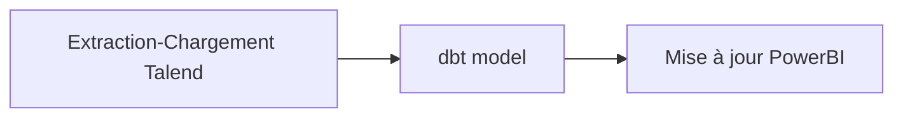

## Le contexte du REX autour de la construction d'une plateforme Data pour notre client

Dans le cadre d'une mission Data Engineer pour un client du [Studio Eleven Labs](https://eleven-labs.com/conception-d-application), j'ai rejoint le pôle “Data Factory” pour analyser et comprendre
le comportement des utilisateurs. Cela permet de mieux guider l’ajout des fonctionnalités et des produits à
lancer.

Un Poc ("Proof of Concept", ou preuve de concept) a été mise en oeuvre par l'équipe data. Elle s'articule autour d'un
pipeline ELT (extract, load, transform) en utilisant les technologies suivantes : Google Cloud Platform, Talend, dbt et
Power BI.

Pour rapidement tester le PoC, le pipeline est exécuté sur Jenkins. Cependant, le détournement de l'usage de Jenkins
pour l'exécution du pipeline n'est pas sans incidence. Jenkins n'est pas adapté pour ce travail : pas de retry, écriture
du pipeline en Groovy, un seul environnement d'exécution.

__Comment fiabiliser les traitements et industrialiser le processus de déploiement ?__

C'est dans ce contexte que ma mission commence.

## Le pipeline ELT : Extract, Load, Transform

Avant de commencer les travaux, je me suis intéressé au fonctionnement du pipeline actuel.

Comment ce pipeline fonctionne ? Quelles sont les étapes à respecter ? Quelles sont les besoins de ce pipeline ?

Dans son principe de fonctionnement, il va chercher des données dans différentes sources, les charger dans un entrepôt
de données, transformer et créer de nouvelles structures données pour qu'elles soient ensuite affichées.

Il est nécessaire de bien comprendre le fonctionnement actuel du pipeline avec de commencer tout changement. Ci-dessous, nous allons décortiquer son fonctionnement et lister les principaux composants.

### Extraction et chargement des données dans Google BigQuery

La première phase commence par l'extraction des données. Le pipeline va se connecter à différentes sources de données.

En sources de données, j'ai :

- MySQL
- MongoDB ([voir notre article de blog sur MongoDB](https://blog.eleven-labs.com/fr/symfony-et-mongodb-retour-aux-sources/))
- Appel HTTP vers des API externes

Pour la phase d'extraction et le chargement dans [Google BigQuery](https://cloud.google.com/bigquery/docs/introduction),
Talend a été mis en place pour effecter ce travail. C'est un outil qui permet de faire des pipelines ETL (Extract,
Transform, Load ; à ne pas confondre avec ELT) complètes. Ici, il a été utilisé pour faire
uniquement la phase d'extraction et de chargement dans Google BigQuery.

Le développement et la modification nécessitent un client lourd et une compilation manuelle du pipeline d'extraction.

Une fois que la donnée est dans BigQuery, la phase de transformation peut commencer.

### Transformation avec dbt

En deuxième étape, il y a la transformation des données.

Cette transformation est effectuée par [dbt](https://www.getdbt.com/) directement dans l'entrepôt de données Google
BigQuery.

dbt permet d'organiser la transformation des données et de
templatiser les requêtes SQL. C'est Google BigQuery qui exécute les requêtes SQL.

Durant cette phase de transformation, de nouvelles structures de données sont créées afin de stocker le résultat des calculs. Ces
aggrégats de données sont ensuite affichés par un outil de visualisation de données : Power BI.

### Affichage des données avec Power BI

Enfin, en dernière étape de ce pipeline, il y a l'affichage des données.

Le but final de tout ce travail est d'éviter d'effectuer tous les calculs au moment d'afficher les rapports d'analyse.
Sans le travail en amont de calcul et d'aggrégation de données, l'affichage des graphiques serait très longs.

Ce pipeline est fonctionnel et déjà en place avec Jenkins. Voyons l'architecture de la nouvelle plateforme data.

## Architecture de la plateforme data

Nous avons vu dans la précédente partie le fonctionnement du pipeline ELT dans Jenkins. Le but est de transposer cela dans
une plateforme plus robuste et adaptée à ce type de travail.

Pour cela, nous avons besoin d'un outil pour orchestrer ces différentes étape du pipeline et de les relancer en cas d'
erreur. Apache Airflow est le parfait candidat. Google propose une version gérée : Google Composer.

Les pré-requis pour cette nouvelle infrastructure sont les suivants :

- Utiliser Google Composer
- Utiliser le maximum d'outils gérés par Google pour faciliter la maintenance
- Infrastructure as Code avec Terraform
- Des environnements séparés et dédiés pour les tests
- Tout le code nécessaire pour effectuer une tâche est dans une image Docker
- Surveillance et alerte en cas d'échec

Nous avons donc le schéma suivant :


Le schéma est assez dense, nous allons le décomposer.

Tout d'abord, il y a une ligne de séparation entre l'infrastructure data et l'infrastructure dit devops, qui est
propriétaire des bases de données. Cette démarcation se traduit dans le code de l'infrastructure et permet de
bien délimiter les responsabilités entre les équipes.

Nous retrouvons donc en partie supérieure du schéma les sources de données de type base de données qui sont géréeé par
l'équipe devops e-commerce. Nous ferons des demandes d'accès à ces sources.

Dans la partie inférieure, nous retrouvons toute l'infrastructure data. Il y a de nombreux services gérés par Google.

Nous pouvons lister les services suivants :

- Secret Manager
- Artifact Registry
- Composer
- Cloud Storage
- Cloud IAM
- Cloud Logging
- Cloud Monitoring
- BigQuery

Et pour l'environnement de développement spécifiquement, nous avons :

- Cloud SQL
- MongoDB Atlas

Toute l'installation et la configuration de l'infrastructure est effectuée avec Terraform.

Une fois l'architecture dessinée et communiquée à l'équipe, nous pouvons la mettre en oeuvre.

## Conditionnement des charges de travail

Une fois que l'infrastructure est configurée avec Terraform, il reste à déployer le pipeline ELT que nous avons décrit
précédemment. Il y a deux étapes : Extraction-Chargement, et Transformation. La première étape est effectuée par Talend, la
seconde par dbt.

Le service Composer utilise Kubernetes pour exécuter Apache Airflow. En quelques mots, [Apache Airflow](https://airflow.apache.org/) est un logiciel libre qui permet d'exécuter et d'ordonnancer des tâches.

Il serait donc intéressant d'exécuter nos travaux dans Kubernetes. Pour cela, nous avons besoin d'une image Docker.

Talend et dbt sont conditionnés dans des images Docker. Il faudra écrire les fichiers Dockerfile et construire les images qui seront stockées dans le service Artifact Registry. Ainsi, à l'aide de l'opérateur [KubernetesPodOperator](https://airflow.apache.org/docs/apache-airflow-providers-cncf-kubernetes/stable/operators.html) fourni par Apache Airflow, les charges de travail Talend et dbt sont exécutées dans Kubernetes.

L'usage des images Docker facilite grandement l'usage d'outils divers et variés qui ne seraient pas compatibles avec l'environnement Composer.

Je n'ai pas rencontré de difficulté particulière, hormis le choix de l'image de base pour Talend. Il [n'existe plus d'image](https://github.com/docker-library/openjdk/issues/505) officiel OpenJDK JRE. J'ai dû chercher et selectionner une image d'une des organisations qui construit une image Docker viable. L'image Docker de base fournie par l'organisation Adoptium me semblait la plus mûre : [https://hub.docker.com/_/eclipse-temurin/](https://hub.docker.com/_/eclipse-temurin/)

Passons à la contruction du pipeline en lui-même.

## Le pipeline avec un Graph Orienté Acyclique

Talend et dbt sont nos deux principales briques. Il reste à les organiser dans un fichier : un DAG. DAG pour _Directed Acyclic Graph_ ou Graph Orienté Acyclique en français. Pour simplifier, le graph se lit dans un sens, il a un début et une fin, et il n'est pas possible de revenir au début du graph.



Ce diagramme va se traduire de cette façon dans un DAG Airflow.

```python
from airflow import models
from airflow.providers.cncf.kubernetes.operators.pod import (
    KubernetesPodOperator,
)


with models.DAG(...) as dag:
    talend = KubernetesPodOperator(...)
    dbt_model = KubernetesPodOperator(...)
    refresh_power_bi = KubernetesPodOperator(...)

    talend >> dbt_model >> refresh_power_bi
```

On retrouve dans le DAG l'opérateur _KubernetesPodOperator_, et enfin l'ordre des tâches qui seront exécutées par Airflow.

La création du DAG n'est pas complexe en soit. Il y a des petites subtilités à bien comprendre pour maitriser le fonctionnement d'Airflow.

Je vous en cite deux ci-dessous : les différentes dates dans Airflow, et la gestion des ressources.

Ces deux points sont essentiels pour comprendre le fonctionnement d'Airflow.

### Date de déclenchement, interval de date de données

En plus de la notion de date de déclenchement de traitement, il y a les dates d'intervalles de données. Airflow va déclencher un traitement pour un intervalle de dates de données antérieur à la date de déclenchement et de la durée de la prochaine date de déclenchement.

Prenons l'exemple suivant, pour un DAG configuré avec `schedule="0 0 * * *"`. Airflow doit déclencher un traitement tous les jours à minuit.

Pour le jour actuel 18 octobre 2023 00h00 UTC
- la date de déclenchement : "18 octobre 2023 00h00 UTC"
- la date de début de traitement des données : 17 octobre 2023 00h00 UTC
- la date de fin de traitement des données : 17 octobre 2023 23h59 UTC
- la date de prochain déclenchement : "19 octobre 2023 00h00 UTC"

Pour plus d'informations, [https://airflow.apache.org/docs/apache-airflow/stable/core-concepts/dag-run.html#data-interval](https://airflow.apache.org/docs/apache-airflow/stable/core-concepts/dag-run.html#data-interval)

Cette notion n'est pas importante dans notre cas d'usage, mais elle l'est lorsque les traitements doivent extraire des données sur un intervalle de dates. Cela permet de ne prendre qu'une partie des données et non l'intégralité. Il est également possible de rejouer des traitements sur une période spécifique.

N'oubliez pas que les dates sont dans le fuseau horaire UTC ! Si votre grappe Composer démarre à minuit au fuseau horaire Europe/Paris (donc 22h00 UTC __la veille__), il va avoir un double traitement : 1 traitement pour l'intervalle de dates de donnée de la veille et 1 autre pour l'intervalle de dates de données du jour du démarrage du Composer.

### Gérer les resources

Gérer les resources CPU et mémoire n'est pas évident, en particulier sur des langages inconnus.

De manière générale, plus la charge de travail a de la ressource, plus elle va faire le traitement rapidement. C'est le cas de Talend.

Avec 1 CPU et 4Gio de mémoire, l'exécution était longue. En passant à 4 CPU et 8Gio, ça réduit le temps de moitié.

Dans le DAG, cela se traduit de cette façon :

```python
from kubernetes.client import models as k8s_models
from airflow.providers.cncf.kubernetes.operators.pod import (
    KubernetesPodOperator,
)

talend = KubernetesPodOperator(
    (...)
    container_resources=k8s_models.V1ResourceRequirements(
        requests={
            "cpu": "4",
            "memory": "8G",
        },
    ),
)
```

Les graphiques dans Google Monitoring m'ont aidé à faire ce changement et à surveiller l'utilisation des resources.

Il est essentiel d'avoir un système de surveillance et d'alerte le plus tôt possible dans le projet, cela permet de voir rapidement l'évolution de l'usage des ressources et d'y remédier.

Pour le moment, cette nouvelle infrastructure n'est pas encore en production, mais elle possède tous les composants nécessaires à sa mise en production.

## Mise en production

Tout ce travail est inutile s'il n'est pas mis en production. Pour préparer la mise en production, j'ai mis en place une copie à l'identique de tous les dataset BigQuery d'origine vers la nouvelle infrastructure. J'ai utilisé le service _Google Data Transfers_.

Ensuite, j'ai rédigé une liste de vérification pour m'assurer de ne rien oublier. J'anticipe au maximum toutes les étapes. Le risque est une perte complète des données lors de la transition. Cette liste doit être la plus explicite et directive possible. Il faut être en mesure de dérouler sans se poser de question.

Je me suis synchronisé avec l'équipe pour planifier la mise en production.

Le jour J, la liste est déroulée. Une fois la mise en production terminée, il y a une surveillance active des traitements. Le tableau de bord de surveillance est vérifié quotidiennement. Dès qu'il y a une erreur, elle est corrigée au plus tôt, et de nouveau il y a une surveillance active de ce correctif.

## Et la suite ?

Suite à cette mise en production, l'infrastructure ne va pas beaucoup changer. Il y aura principalement de la maintenance et des mises à jour à effectuer, en particulier sur le service Composer.

Un des points de souffrance sur le pipeline est Talend. Cet outil ne s'adapte pas bien à un environnement Cloud. Le projet serait de trouver une solution alternative. Quel serait l'outil adapté pour de l'extraction de données et qui serait complètement géré par Google ?

## Pour conclure, mon retour d'expérience

La construction de cette plateforme data a été un grand projet de notre [Studio Eleven Labs](https://eleven-labs.com/nos-publications/donnez-une-nouvelle-dimension-a-votre-equipe-produit). Tout a été construit depuis zéro. J'ai bien cerné la problématique, cela m'a permis d'identifier tous les éléments sur le fonctionnement du pipeline. La solution a été de s'adapter à son fonctionnement et aux pré-requis. Enfin, la mise en production s'est déroulée comme prévu. La mise en place d'une surveillance active m'a permis de détecter les erreurs en amont. Cela réduit considérablement les temps d'indisponibilité de la plateforme.

Pour ma part, cette mission a été très complète. J'ai tantôt été _Architecte_ avec la conception de l'infrastructure, _Ops_ avec l'écriture du Terraform et de la bonne compréhension de Google Cloud Platform, et enfin _Dev_ avec la rédaction du DAG Airflow. J'en ressort avec encore plus d'expérience !
