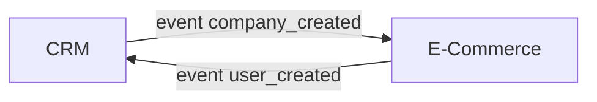

Dans cet article, nous allons nous plonger dans l'intégration d'un CRM (Customer Relationship Management) avec une application e-commerce.

Nous vous donnerons des exemples concrets sur lesquels nous avons travaillé au sein du [Studio Eleven Labs](https://eleven-labs.com/conception-d-application).

## Contexte

Nous utilisons un CRM SaaS (Software as a Service) doté de fonctionnalités qui jouent un rôle central dans la gestion efficace des relations clients. Ce CRM offre aussi la possibilité d'utiliser une API et des webhooks (qui permettent de recevoir des notifications en temps réel) qui vons nous permettre de connecter ce système à nos autres applications.

En parallèle de ce CRM se trouve une plateforme e-commerce personnalisée, qui représente le cœur de notre activité : nous souhaitons les connecter.

Bien entendu, ces principes d'intégration pourraient s'appliquer également à divers systèmes externes, comme des ERP (Enterprise Resource Planning), et différents CRMs comme Salesforce et HubSpot (Restez à l'affût, car nous publierons bientôt des articles détaillés sur les spécificités d'intégration avec ces CRMs). Mais pour les besoins de notre exemple dans cet article, nous allons prendre en considération seulement HubSpot.

Pour réaliser cette intégration, nous allons adopter une approche basée sur le concept d'*Event Driven Design*, où des événements (events) se déclenchent des deux côtés de l'équation, et nous utiliserons l'outil RabbitMQ pour faciliter cette synchronisation bidirectionnelle.

Je vous invite à consulter cet [article de Marie](https://blog.eleven-labs.com/fr/event-driven-architecture-examples/) qui explore plus en profondeur ce concept d'*Event Driven* que nous utilisons de manière générale pour communiquer entre nos applications, que ce soient des microservices ou avec des applications externes comme des CRMs.

Par exemple, des événements peuvent provenir de notre plateforme e-commerce (comme `business_created` ou `purchase_updated`) et aussi du CRM (comme `company_edited`). Les événements se manifestent des deux côtés.

Lorsque l'on synchronise un CRM avec une application e-commerce, il faut d'abord bien définir les objets métiers à synchroniser et
il est essentiel de prendre en compte des correspondances entre ces objets des deux systèmes qui peuvent avoir des formats différents.

Par exemple, un `contact` côté CRM équivaut à un `user` côté e-commerce, une `company` à un `business`, et un `order` à un `purchase`.

## Concepts de notre solution

Dans notre exemple de synchronisation depuis Hubspot vers le e-commerce, le CRM peut déclencher un webhook pour notifier une chagement spécifique de statut de `Company` ou `Contact` côté CRM.

La première solution simple à laquelle on pense serait de réceptionner ce webhook directement sur notre plateforme e-commerce puis de faire ensuite des appels GET synchrones à l'API d'Hubspot pour récupérer les données avant de les enregistrer.

Mais cela nécessiterait de faire plusieurs appels API pour récupérer toutes les informaitons à synchroniser : `Company` et tous les `Contacts` liés par exemple. Ces nombreux appels API rendent complètement dépendante notre application e-commerce qui se retrouve couplée au CRM.

Imaginons aussi qu'un problème survienne au moment de la synchronisation des `Contacts` de la `Company` en question, à cause d'un souci d'accès à l'API HubSpot ou la base de données de notre e-commerce par exemple, nous aurions une `Company` enregistrée sans aucun `Contact`, et une erreur dans les logs. Il faudrait re-GET les informations des `Contacts` liés à cette `Company`.

Ainsi, lors de notre implémentation, nous avons opté pour une approche plus adaptée basée sur de l'*Event Driven Design* ([lien vers l'article de Marie](https://blog.eleven-labs.com/fr/event-driven-architecture-examples/)),
asynchrone, avec une politique de "retry" pour gérer au mieux les possibles erreurs, le tout orchestré par un microservice dédié à cette synchronisation.

### Un microservice responsable de la synchronisation

Tout d'abord, pour gérer ce processus nous avons mis en place une application dédiée, seule responsable de gérer cette synchronisation.

C'est donc cette application qui va être capable de recevoir les différents événements provenant :
- de la plateforme e-commerce, via un broker d'event RabbitMQ
- du CRM, via webhook HTTP

Ensuite pour chaque événement reçu, ce service va récupérer les données dans l'application source qui a émis l'événement, puis transformer et mapper ces données pour ensuite mettre à jour ces informations dans l'autre application de destination.

### Asynchrone

Nous avons choisi d'implémenter cette synchronisation de manière asynchrone pour que nos applications CRMs et e-commerce restent découplées et indépendantes.

Aussi, dans notre contexte, nous n'avions pas besoin d'un retour synchrone visible sur les interfaces utilisateurs des applications qui ferait apparaître en temps réel un statut de synchronisation.

Également, cette implémentation *Event Driven Design* asynchrone offre une grande résilience.
Lorsqu'un événement est publié, il est stocké dans une file d'attente : queue RabbitMQ dans notre cas.
Si, pour une raison quelconque, la synchronisation échoue, les événements restent dans la file d'attente, prêts à être traités à nouveau.
Cela signifie que les erreurs temporaires ou les pannes de système n'impactent pas la synchronisation des données.
De plus, la possibilité de mettre en place des mécanismes de "retry" automatique garantit que les données seront finalement synchronisées avec succès, même en cas de problèmes temporaires.

_Synchronisation de Hubspot vers le e-commerce_

Sur le schéma ci-dessus, voici les différentes étapes de la synchronisation Hubspot vers e-commerce :
- Un webhook est déclenché côté Hubspot et réceptionné par le microservice de synchronisation (1)
- Un event est publié dans RabbitMQ avec l'ID de la `Company`, stockée sur MongoDB (1)
- Un consumer RabbitMQ consomme le message et fait un GET de la `Company` et des `Contacts` associés vers HubSpot (2)
- Ces informations sont stockées dans MongoDB (2)
- On publie ces informations de `Company` et `Contact` dans RabbitMQ (3)
- Un consumer côté e-commerce récupère ces informations et les stocke dans sa base de données (3)
- Le e-commerce publie les IDs des `Company` et `Contacts` tels que définis côté e-commerce dans RabbitMQ (4)
- Un Consumer consomme ces données et met à jour ces IDs dans les `Company` & `Contacts` côté Hubspot (4)

_Synchronisation du e-commerce vers HubSpot_

Notre synchronisation étant bidirectionnelle, de manière similaire, les mêmes étapes sont réalisées dans l'autre sens, avec des consumers différents.

### Retry

On en avait parlé dans [un article précédent](https://blog.eleven-labs.com/fr/publier-consommer-reessayer-des-messages-rabbitmq/) : nous pouvons facilement configurer une stratégie de "retry" sur chaque queue et consumer RabbitMQ, avec la possiblité de configurer des durées et timeout de retry différents par process.

Cette stratégie de "retry" permise par RabbitMQ est un point important dans notre implémentation de process de synchronisation pour être résilient aux erreurs et parce que nous dépendons d'un CRM en service externe SaaS que nous ne maîtrisons pas. Ainsi si ce service est temporairement indisponible, nous laissons nous consumers "retry" jusqu'à ce que le service soit fonctionnel à nouveau.

Dans notre exemple illustré sur les schémas ci-dessus, nous faisons en sorte que chaque étape soit implémentée dans un consumer dédié avec un stockage "intermédiaire" en base de données. Cela rend donc chaque étape indépendante, bénéficiant de son propre "retry".

Aussi, même pour une simple réception de webhook venant du CRM, on a choisi de stocker et republier cet événement directement dans notre broker RabbitMQ, pour être sûr de ne pas dépendre d'autres appels APIs, qui sont ainsi découplé dans d'autres étapes qui ont leur propre consumer et mécanisme de "retry".

Note

Il est aussi intéressant de porter attention aux types d'erreurs possibles dans nos consumers pour ne "retry" que certains types. Par exemple, il est important de s'assurer que l'on "retry" dans le cas d'erreur réseau ou d'erreur serveur "500" retournée par le CRM SaaS externe. A l'inverse, les erreurs "400 Bad Request" peuvent être ignorées et non "retry" puisqu'après "retry" les données envoyées à l'API seront toujours invalides.

### Presque Real-Time

Cette stratégie permet une synchronisation presque en temps réel.
Bien que cela soit asynchrone, la latence est généralement très faible.
Les événements sont traités rapidement, ce qui signifie que les mises à jour des données dans votre CRM ou e-commerce sont quasi-instantanées.

Dans notre cas, la synchronisation presque en temps réel est une approche qui privilégie la réactivité, l'expérience utilisateur, le suivi en temps réel des activités et la réduction de la latence.

A l'inverse, une synchronisation par lots (batching) une fois par jour est moins réactive, peut générer des problèmes de performance et entraîne des retards dans la mise à jour des données qui peuvent avoir des impacts fonctionnels.

Le choix entre ces deux approches dépend des besoins spécifiques de votre entreprise et de vos objectifs en matière de gestion des données.

### Initialisation des données

Lors de l'implémentation d'un tel processus de synchronisation, on pense forcément à gérer tous les cas de futures modifications du côté de l'application source à répliquer vers la plateforme de destination.

Mais il ne faut pas non plus négliger une problématique qui n'interviendra qu'une seule fois, lors de la mise en production de ce processus : l'initialisation des données du côté de l'application de destination, pour prendre en compte les données déjà existantes du côté de l'application source.

Par exemple, il s'agit de créer tous les `users` historiques du e-commerce du côté du CRM lorsque celui-ci est nouvellement ajouté à notre stack.

Si nous avions choisi une approche de synchronisation en batch une fois par jour par exemple, ce process aurait géré de la même façon les données déjà existantes au préalable et les données modifiées ensuite : tous les jours, on copie simplement toutes les données de la source vers la destination.

Mais dans notre cas, avec cette approche *Event Driven* asychrone "presque temps réel", l'initialisation des données requière une implémentation un peu différente.

Pour autant, nous n'avons pas envie d'implémenter deux processus de synchronisation complets, dupliqués en termes de fonctionnalités mais différent dans l'implémentaion, pour gérer l'initilisation et la synchronisation en "temps réel" après initilisation.

Ainsi pour intilialiser les données dans le CRM nouvellement ajouté, nous avons choisi de mettre en place un script d'initialisation qui :
- Récupère tous les identifiants des entités existantes côté e-commerce (`user`, `business`, `purchase`)
- Publie tous ces identifiants dans la queue RabbitMQ déjà utilisée par notre process de synchronisation asynchrone : celle qui reçoit déjà les évenements de modifications venant du e-commerce. Ainsi chaque message ajouté à cette queue va déclencher la création de l'entité correspondante vers le CRM, une par une, pour chaque message empilé dans cette queue.

De cette façon, nous tirons partie du process de synchronisation déjà mis en place plutôt que de dupliquer pour l'initialisation. Aussi nous bénéficions de la même résilience grâce au mécanisme de "retry".

Par contre, avec cette approche, vous vous retrouvez avec des centaines de milliers de message publier dans vos queue de synchronisation dès l'exécution du script d'initialisation. Cela peut causer ces problèmes :
- Les consumers de synchronisation dépendant d'appels vers les API externes du CRM, chaque message prend un certain temps à être consommé. Au global les messages sont donc dépilés lentement et l'initialisation peut prendre plusieurs jours.
- Aussi pendant toute la durée de l'initialisation, tant que des messages liés à des données historiques sont présents dans les queues, les nouveaux messages ajoutés dans ces mêmes consumers pour de nouvelles données mises à jours côté e-commerce se retrouvent bloqués et ne seront dépilés qu'une fois l'initialisation terminée, donc potentiellement au bout de plusieurs jours. On perd donc l'avantage de la synchronisation "presque temps réel" pendant cette phase.
- Egalement, ces milliers d'entités à synchroniser à l'initialisation vont causer autant d'appels API vers un service externe CRM qui a certainement une stratégie de "rate limiting". A chaque fois qu'une limite API est atteinte, les consumers vont retry, jusqu'à ce que le délai de limite soit expiré. Cela va donc ralentir le processus de synchonisation. Mais aussi, cela peut avoir d'autres impacts si vous avez d'autres processus ou applications qui appellent cette même API du CRM puisqu'eux aussi vont se retrouver bloqués.

C'est pour cela que nous ajustons notre script pour gérer par lots (batching) cette phase d'initlisation :
- Plutôt que de récupérer et publier toutes les entités existantes côté e-commerce d'un seul coup, nous ajoutons des arguments à notre script pour ne récupérer qu'une plage d'IDs ou seulement des entités filtrées, par date de création par exemple.
- Nous exécutons ensuite ce script d'initialisation plusieurs fois de suite avec des arguments de filtres différents, en laissant le temps à la synchronisation de se faire avant de lancer à nouveau avec les arguments suivants. Par exemple, on lance une première fois seulement pour les entités modifiés lors du mois précédent. Puis on attend que ces entités soient bien initialisées et on vérifie que le process de synchronisation "presque temps réel" fonctionne bien en parallèle pour les nouvelles modifications d'entités. Seulement ensuite et de manière itérative, on lance ce script avec des dates antérieures pour initialiser les donnnées plus anciennes

Voici certains avantages que nous avons notés lors de cette initialisation en batch :
- **Contrôle et précision** : Cela permet de planifier soigneusement la migration initiale, de réaliser des tests, d'identifier et de résoudre les problèmes potentiels avant le transfert complet des données.
- **Minimisation des perturbations** : Les migrations initiales de données peuvent être des tâches complexes, surtout lorsque de grandes quantités de données doivent être déplacées. Le batching vous permet de minimiser les perturbations dans les opérations quotidiennes, car vous pouvez planifier la migration en dehors des heures de pointe.
- **Réversibilité** : En cas d'erreur ou de problème imprévu lors de la migration, la synchronisation par lots offre la possibilité de revenir en arrière, d'ajuster les données, et de réessayer. Cela réduit les risques liés à la perte de données critiques.
- **Optimisation des performances** : Lors d'une migration initiale, les volumes de données sont généralement importants. La synchronisation par lots permet d'optimiser les performances en transférant les données de manière efficace, en minimisant les goulots d'étranglement, et en garantissant que le système fonctionne de manière stable pendant le processus.

## Nos conseils généraux

### Configuration de votre CRM

Pour synchroniser les données de votre système vers un nouveau CRM, comprendre en profondeur le CRM que vous allez intégrer est une étape essentielle.
Avant de vous lancer dans le développement, assurez-vous de bien analyser le CRM cible, testez sa connectivité API, et familiarisez-vous avec le processus de configuration des applications, ainsi que la gestion des identifiants (credentials) qui donnent accès à l'API depuis un système externe.
Assurez vous également que ce CRM supporte les webhooks dont vous aurez besoin pour mettre en place une approche *Event Driven*.
Cette préparation minutieuse vous permettra d'éviter des erreurs coûteuses et de garantir une intégration fluide.

### Modèle de données

Lors de la mise en place de votre intégration, il est essentiel de s'assurer d'un modèle de données cohérent entre le CRM et la plateforme e-commerce.
Voici comment procéder de manière méthodique :

1. **Comparaison des objets et propriétés à synchroniser** :
   - Créez un tableau de correspondance avec des colonnes pour le CRM et l'e-commerce.
   - Répertoriez les propriétés des entités des deux côtés pour un aperçu clair.
   - Assurez-vous que les types de données concordent entre les deux systèmes.
2. **Règles de validation** :
   - Établissez des règles de validation cohérentes dans les deux systèmes à synchroniser, telles que la vérification des adresses e-mail ou téléphones, la longueur des propriétés chaines de caractères, etc.
   - Incluez des règles fonctionnelles, telles que la dépendance entre les champs (p. ex. un champ requis uniquement si un autre est rempli).

## Conclusion

Nous avons ainsi mis en avant notre expérience au sein du [Studio Eleven Labs](https://eleven-labs.com/conception-d-application) au sujet de l'intégration d'un CRM avec une application e-commerce, basée sur une approche *Event Driven*, asynchrone et quasi "temps" réel.

Vous aurez compris l'importance de mettre en place un processus résilient aux erreurs, ce qui est permis par le "retry", mais aussi de soigner toutes les étapes de synchronisation, y compris la migration initiale des données historiques.

Egalement, gardez bien en tête l'importance de comprendre en profondeur le CRM à intégrer, de préparer minutieusement l'approche d'intégration, et de veiller à un modèle de données cohérent entre les systèmes pour une intégration réussie et fluide.
