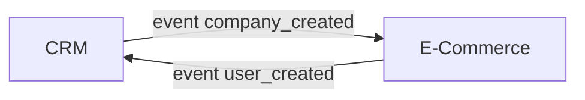

Dans cet article, nous allons nous plonger dans l'intégration d'un CRM (Customer Relationship Management) avec une application e-commerce.

Nous vous donnerons des exemples concrets sur lesquels nous avons travaillé au sein du [Studio Eleven Labs](https://eleven-labs.com/conception-d-application).

## Contexte

Nous utilisons un CRM SaaS (Software as a Service) doté de fonctionnalités qui jouent un rôle central dans la gestion efficace des relations clients. Ce CRM offre aussi la possibilité d'utiliser une API et des webhooks (qui permettent de recevoir des notifications en temps réel) qui vons nous permettre de connecter ce système à nos autres applications.

En parallèle de ce CRM se trouve une plateforme e-commerce personnalisée, qui représente le cœur de notre activité : nous souhaitons les connecter.

Bien entendu, ces principes d'intégration pourraient s'appliquer également à divers systèmes externes, comme des ERP (Enterprise Resource Planning), et différents CRMs comme Salesforce et HubSpot (Restez à l'affût, car nous publierons bientôt des articles détaillés sur les spécificités d'intégration avec ces CRMs). Mais pour les besoins de notre exemple dans cet article, nous allons prendre en considération seulement HubSpot.

Pour réaliser cette intégration, nous allons adopter une approche basée sur le concept d'*Event Driven Design*, où des événements (events) se déclenchent des deux côtés de l'équation, et nous utiliserons l'outil RabbitMQ pour faciliter cette synchronisation bidirectionnelle.

Je vous invite à consulter cet [article de Marie](https://blog.eleven-labs.com/fr/event-driven-architecture-examples/) qui explore plus en profondeur ce concept d'*Event Driven* que nous utilisons de manière générale pour communiquer entre nos applications, que ce soient des microservices ou avec des applications externes comme des CRMs.

Par exemple, des événements peuvent provenir de notre plateforme e-commerce (comme `business_created` ou `purchase_updated`) et aussi du CRM (comme 'company_edited'). Les événements se manifestent des deux côtés.

Lorsque l'on synchronise un CRM avec une application e-commerce, il faut d'abord bien définir les objets métiers à synchroniser et
il est essentiel de prendre en compte des correspondances entre ces objets des deux systèmes qui peuvent avoir des formats différents.

Par exemple, un `contact` côté CRM équivaut à un `user` côté e-commerce, un `order` à un `purchase`, et un `company` à un `business`.

## Concepts généraux

Maintenant rentrons un peu plus dans les détails des concepts implémentés pour gérer au mieux cette synchronisation.

Lors de notre implémentation, nous avons opté pour un *Event Driven Design* ([lien vers l'article de Marie](https://blog.eleven-labs.com/fr/event-driven-architecture-examples/)), asynchrone, avec une politique de "retry" pour gérer au mieux les possibles erreurs, le tout orchestré par un microservice dédié à cette synchronisation.

### Un microservice responsable de la synchronisation

Tout d'abord, pour gérer ce processus nous avons mis en place une application dédiée, seule responsable de gérer cette synchronisation.

C'est donc cette application qui va être capable de recevoir les différents événements provenant :
- de la plateforme e-commerce, via un broker d'event RabbitMQ
- du CRM, via webhook HTTP

Ensuite pour chaque événement reçu, ce service va récupérer les données dans l'application source qui a émis l'événement, puis transformer et mapper ces données pour ensuite mettre à jour ces informations dans l'autre application de destination.

### Asynchrone

Nous avons choisi d'implémenter cette synchronisation de manière asynchrone pour que nos applications CRMs et e-commerce restent découplées et indépendantes.

Aussi dans notre contexte, nous n'avions pas besoin d'un retour synchrone visible sur les interfaces utilisateurs des applications qui ferait apparaître en temps réel un statut de synchronisation.

Également, cette implémentation *Event Driven Design* asynchrone offre une grande résilience.
Lorsqu'un événement est publié, il est stocké dans une file d'attente : queue RabbitMQ dans notre cas.
Si, pour une raison quelconque, la synchronisation échoue, les événements restent dans la file d'attente, prêts à être traités à nouveau.
Cela signifie que les erreurs temporaires ou les pannes de système n'impactent pas la synchronisation des données.
De plus, la possibilité de mettre en place des mécanismes de "retry" automatique garantit que les données seront finalement synchronisées avec succès, même en cas de problèmes temporaires.

Le besoin sur notre application est de récupérer les informations de `Company` et de `Contacts` associés au trigger, et de les stocker.
Dans notre exemple de synchronisation avec Hubspot, nous avons un webhook qui est trigger lorsqu'un statut spécifique de Company est changé côté CRM.

Une solution simple et synchrone serait de GET ces informations via l'API d'Hubspot.

Imaginons qu'un problème survient au moment de la synchronisation des Contacts de la Company en question, quel est l'état de notre base de données côté applicatif ?

Nous aurons une Company enregistrée avec aucun contact, et une erreur dans les logs.
Aussi il faudrait re-GET les informations de contacts liés à cette `Company`.

Même problème pour la `Company`, où en cas d'erreur sur notre application, nous devons refaire un appel pour récupérer ces mêmes informations.

### Retry

On en avait parlé dans [un article précédent](https://blog.eleven-labs.com/fr/publier-consommer-reessayer-des-messages-rabbitmq/) : nous pouvons facilement configurer une stratégie de "retry" sur chaque queue et consumer RabbitMQ, avec la possiblité de configurer des durées et timeout de retry différents par process.

Cette stratégie de "retry" permise par RabbitMQ est un point important dans notre implémentation de process de synchronisation pour être résilient aux erreurs et parce que nous dépendons d'un CRM en service externe SaaS que nous ne maîtrisons pas. Ainsi si ce service est temporairement indisponible, nous laissons nous consumers "retry" jusqu'à ce que le service soit fonctionnel à nouveau.

Dans notre exemple plus haut, suite à la réception du webhook venant du CRM, on a choisi de publier un événement correspondant dans notre broker RabbitMQ pour pouvoir bénéficier de ces fonctionnalités de "retry".
Cet event est stocké dans la queue, donc si des soucis opèrent au niveau du GET des Companies et Contacts, l'opération reprendra.

Note

Il est aussi intéressant de porter attention aux types d'erreurs possibles dans nos consumers pour ne "retry" que certains types. Par exemple, il est important de s'assurer que l'on "retry" dans le cas d'erreur réseau ou d'erreur serveur "500" retournée par le CRM SaaS externe. A l'inverse, les erreurs "400 Bad Request" peuvent être ignorées et non "retry" puisqu'après "retry" les données envoyées à l'API seront toujours invalides.

Dans un second temps, à chaque GET de `Company`/`Contact`, on stocke ces informations dans notre BDD Mongo.
Ces informations sont uniquement exploitées dans le cadre de ces consumers, pour la suite des opérations.

S'il survient une erreur côté synchronisation, on ne va pas vouloir recommencer toute l'opération de GET côté Hubspot :
ces informations sont stockées dans notre base de données.

Notons que la synchronisation CRM ⇔ notre App est aussi faite à travers des consumers, donc nous avons la même politique de "retry" qui s'applique.

### Presque Real-Time

Cette stratégie permet une synchronisation presque en temps réel.
Bien que cela soit asynchrone, la latence est généralement très faible.
Les événements sont traités rapidement, ce qui signifie que les mises à jour des données
dans votre CRM sont quasi-instantanées.

Dans notre cas, la synchronisation presque en temps réel est une approche qui privilégie
la réactivité, l'expérience utilisateur, le suivi en temps réel des activités et la
réduction de la latence. En revanche, la synchronisation par lots (batching)
une fois par jour est moins réactive, peut générer des problèmes de performance et peut
entraîner des retards dans la mise à jour des données.
Le choix entre ces deux approches dépend des besoins spécifiques de votre entreprise
et de vos objectifs en matière de gestion des données.

### Initialisation des données

Lorsque vous envisagez d'intégrer une nouvelle plateforme e-commerce à votre CRM existant,
ou lorsque vous migrez vers un nouveau CRM, l'une des étapes critiques est l'initialisation
des données.
Cette phase consiste à transférer l'ensemble des données historiques,
telles que les informations sur les clients, les contacts, et bien plus encore,
du CRM vers votre plateforme (ou autre CRM).
C'est là que la synchronisation par lots (batching) joue un rôle crucial.

Voici certains avantages que nous avons notés lors d'une synchronisation par batching :

- **Contrôle et Précision** : Lors de la migration initiale, il est essentiel d'avoir un contrôle
précis sur les données qui sont transférées.
Le batching permet de planifier soigneusement la migration, de réaliser des tests,
d'identifier et de résoudre les problèmes potentiels avant le transfert complet des données.
- **Minimisation des Perturbations** : Les migrations initiales de données peuvent être des tâches complexes, surtout lorsque de grandes quantités de données doivent être déplacées. Le batching vous permet de minimiser les perturbations dans les opérations quotidiennes, car vous pouvez planifier la migration en dehors des heures de pointe.

- **Réversibilité** : En cas d'erreur ou de problème imprévu lors de la migration, la synchronisation par lots offre la possibilité de revenir
en arrière, d'ajuster les données, et de réessayer.
Cela réduit les risques liés à la perte de données critiques.

- **Optimisation des Performances** : Lors d'une migration initiale,
les volumes de données sont généralement importants.
La synchronisation par lots permet d'optimiser les performances en transférant les données
de manière efficace, en minimisant les goulots d'étranglement,
et en garantissant que le système fonctionne de manière stable pendant le processus.

## REX / Tips & tricks

Comprendre en profondeur le CRM que vous allez intégrer est une étape essentielle.
Avant de vous lancer dans le développement, assurez-vous de bien analyser le CRM cible,
testez sa connectivité API, et familiarisez-vous avec le processus de configuration des
applications, ainsi que la gestion des identifiants (credentials).
Cette préparation minutieuse vous permettra d'éviter des erreurs coûteuses et de garantir
une intégration fluide.

Lors de la mise en place de votre intégration, il est essentiel de s'assurer d'un modèle de données cohérent entre le CRM et l'e-commerce. Voici comment procéder de manière méthodique :
1. **Comparaison des Propriétés** :
   - Créez un tableau de correspondance avec des colonnes pour le CRM et l'e-commerce.
   - Répertoriez les propriétés des entités des deux côtés pour un aperçu clair.
   - Assurez-vous que les types de données concordent entre les deux systèmes.
2. **Règles de Validation** :
   - Établissez des règles de validation cohérentes, telles que la vérification des adresses e-mail, la longueur des propriétés, etc.
   - Incluez des règles fonctionnelles, telles que la dépendance entre les champs (p. ex. un champ requis uniquement si un autre est rempli).

## Conclusion

En résumé, nous avons mis en avant notre expérience au sein du [Studio Eleven Labs](https://eleven-labs.com/conception-d-application) au sujet de l'intégration d'un CRM avec une application e-commerce,
en se concentrant sur une approche asynchrone basée sur des événements.
L'usage d'un outil comme RabbitMQ facilite cette synchronisation bidirectionnelle,
permettant ainsi une gestion efficace des relations clients.

L'approche *Event Driven Design* est explorée en détail, soulignant la résilience offerte par ce modèle face
aux erreurs et pannes temporaires. La stratégie de "retry et l'utilisation de files d'attente
garantissent la synchronisation des données même en cas de problèmes temporaires, tout en minimisant
les perturbations et en offrant une quasi-synchronisation en temps réel.

La nécessité d'une correspondance entre les entités des deux systèmes (CRM et e-commerce)
est également mise en avant, avec une insistance sur la gestion des erreurs,
notamment en cas d'échec de synchronisation.

Par ailleurs, la synchronisation par lots lors de l'initialisation des données a été présentée
comme essentielle pour assurer un transfert précis, minimiser les perturbations et garantir la réversibilité
en cas de problème.

En conclusion lors de votre approche d'intégration, gardez en tête l'importance de comprendre en profondeur le CRM
à intégrer, de préparer minutieusement l'approche d'intégration, et de veiller à
un modèle de données cohérent entre les systèmes pour une intégration réussie et fluide.
