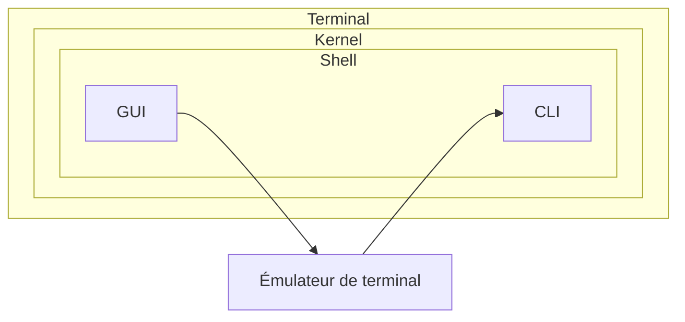
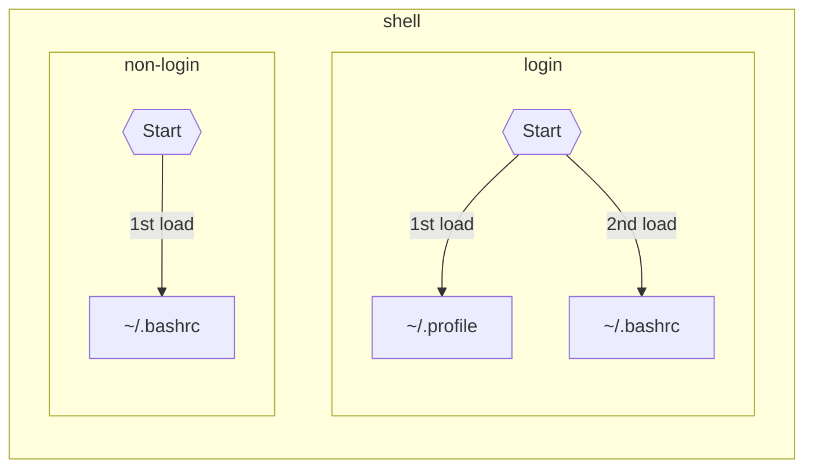
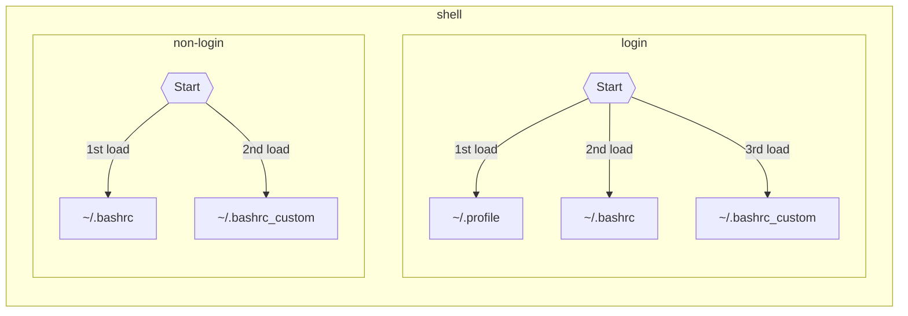
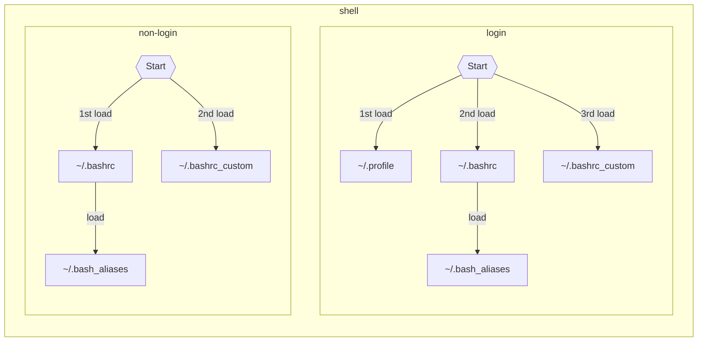

Dans cet article, je vais partager quelques conseils pour optimiser votre environnement de travail sous Linux. Tout ce que nous allons aborder ici représente des éléments que j'ai personnellement mis en place et que j'utilise quotidiennement.
Nous explorerons la configuration de plusieurs accès **`SSH`**, la personnalisation de notre Interface de Ligne de Commande **`CLI`** avec **`bash`**, et comment abandonner l'utilisation de **`zsh`** et **`Oh My Zsh`**.

## Configuration de plusieurs accès SSH dans votre environnement Linux

Pour ce premier conseil, nous allons nous intéresser à **`SSH`**. Il vous est peut-être déjà arrivé d'avoir plusieurs accès **`SSH`** avec des informations de connexion différentes telles que l'adresse du serveur, l'utilisateur, les clés privées et publiques, etc.
Et vous avez probablement utilisé **`SSH`** en spécifiant toutes les informations de connexion, comme dans l'exemple ci-dessous :

```bash
ssh -i path-to-ssh-public-key user@host:port
```

Si vous avez plusieurs accès à différents serveurs **`SSH`**, vous devez probablement faire quelque chose de similaire à ceci :

```bash
ssh -i path-to-ssh-public-key-server-1 user-server-1@host-server-1:port-server-1

ssh -i path-to-ssh-public-key-server-2 user-server-2@host-server-2:port-server-2

ssh -i path-to-ssh-public-key-server-3 user-server-3@host-server-3:port-server-3
```

Si vous êtes un peu paresseux, vous avez peut-être configuré des **`aliases`**. C'est bien, mais non optimal !
Nous allons voir comment configurer notre client **`SSH`** de manière à simplifier tout cela. Allez, c'est parti !

Tout d'abord, vous allez créer le fichier `.ssh/config` avec les permissions suivantes : `0600` ou, si vous préférez, `- rw- --- ---`. Ensuite, vous allez l'éditer avec votre éditeur préféré : [vim]({BASE_URL}/fr/prise-en-main-vim-php/). 😉

Dans ce fichier, nous allons ajouter des blocs de configuration **`ssh`** comme suit :

```text
Host <<nom-super-nom-d-host>>
  Property value
  Property value
```

Vous voyez, ce n'est pas compliqué du tout ! Prenons un exemple plus concret avec un compte **`Gitlab`** auto-hébergé, un compte **`Gitlab`**, un compte **`Github`**, et deux accès à un serveur virtuel :

```text
Host my-private-gitlab.com
  PreferredAuthentications publickey
  User git
  HostName my-private-gitlab.com
  IdentityFile ~/.ssh/id_my-private-gitlab.com

Host github
  User git
  HostName github.com
  IdentityFile ~/.ssh/id_github.com

Host gitlab
  PreferredAuthentications publickey
  User git
  HostName gitlab.com
  IdentityFile ~/.ssh/id_gitlab.com

Host my-private-server-1
  User root
  HostName my-private-server-1.com
  IdentityFile ~/.ssh/id_my-private-server.com

Host my-private-server-2
  User root
  HostName my-private-server-2.com
  IdentityFile ~/.ssh/id_my-private-server.com
```

Ici, pour chaque bloc de configuration, nous définissons les propriétés `Host`, `User`, `HostName`, `IdentityFile` et, dans le cas de **Gitlab**, `PreferredAuthentications`.

Et voilà ! Si nous testons la connexion avec **Github** et **Gitlab**, cela donne ceci :

```bash
# Test de connexion github
$ ssh -i ~/.ssh/id_github.com -T git@github.com
Hi nicolas-grevin! You've successfully authenticated, but GitHub does not provide shell access.

$ ssh -T github
Hi nicolas-grevin! You've successfully authenticated, but GitHub does not provide shell access.

# Test de connexion gitlab

$ ssh -i ~/.ssh/id_gitlab.com -T git@gitlab.com
Welcome to GitLab, @ngrevin!

$ ssh -T gitlab
Welcome to GitLab, @ngrevin!
```

Tout fonctionne bien, et on peut voir que la propriété `Host` agit comme un "alias" **`SSH`** permettant d'utiliser une configuration spécifique. Donc, cette commande `ssh -i ~/.ssh/id_gitlab.com -T git@gitlab.com` revient à faire `ssh gitlab.com`.

> Je conseille quand même de mettre l'alias que vous souhaitez, mais aussi l'adresse de l'hôte entier pour éviter tout problème de connexion avec des programmes tiers. Surtout que la propriété accepte plusieurs valeurs.

Pour aller encore plus loin, vous pouvez avoir des configurations partagées en découpant les blocs de configuration. Voici un exemple :

```text
Host my-private-gitlab github gitlab my-private-gitlab.com github.com gitlab.com
  User git

Host my-private-gitlab gitlab my-private-gitlab.com gitlab.com
  PreferredAuthentications publickey

Host my-private-gitlab my-private-gitlab.com
  HostName my-private-gitlab.com
  IdentityFile ~/.ssh/id_my-private-gitlab.com

Host github github.com
  HostName github.com
  IdentityFile ~/.ssh/id_github.com

Host gitlab gitlab.com
  HostName gitlab.com
  IdentityFile ~/.ssh/id_gitlab.com*

Host my-private-server-1 my-private-server-2 my-private-server-1.com my-private-server-2.com
  User root
  IdentityFile ~/.ssh/id_my-private-server.com

Host my-private-server-1 my-private-server-1.com
  HostName my-private-server-1.com

Host my-private-server-2 my-private-server-2.com
  HostName my-private-server-2.com
```

Cela évite de répéter les propriétés dans chaque bloc tout en laissant la possibilité d'en réécrire une.
Et voilà, maintenant vous savez comment configurer votre client **`SSH`**.
Si vous souhaitez aller plus loin, voici la documentation complète de ssh_config : [man openBSD ssh_config](http://man.openbsd.org/OpenBSD-current/man5/ssh_config.5).

## Configurer son CLI

Avant d'entrer dans le vif du sujet, clarifions certaines définitions.

Un **`terminal`** est un appareil physique situé à l'extrémité d'un réseau informatique (téléphone, ordinateur).
Un **`émulateur de terminal`** est le logiciel qui nous permet d'exécuter des lignes de commande pour interagir avec le système d'exploitation. Par souci de simplicité, on l'appelle couramment un **`terminal`**.
Un **`shell`** est le logiciel qui fournit l'interface utilisateur du système d'exploitation. Littéralement, c'est la coquille (**`shell`**) du noyau (**`kernel`**) Linux. On le trouve sous deux formes :
- le **`CLI (Command Line Interface)`** qui est une interface en ligne de commande.
- le **`GUI (Graphical User Interface)`** qui est une interface graphique.

Donc, pour schématiser tout ça, on a le **`terminal`** qui contient le **`kernel`** Linux. Le **`kernel`** fournit un **`shell`** pour communiquer avec lui. Le **`shell`** peut être soit une interface graphique **`GUI`** soit une interface en ligne de commande **`CLI`**. Et l'émulateur de terminal est un logiciel graphique qui permet d'exécuter des lignes de commande.



Voilà le petit dépoussiérage fait. Bon pour l'**`émulateur de terminal`**, nous utiliserons la forme simple et courante qui est **`terminal`**.
Maintenant, passons au vif du sujet : la configuration de son **`CLI`** avec **`bash`**. Nous allons découvrir les fichiers de configuration ainsi que des bonnes pratiques pour ne pas perdre votre configuration.

Sur les systèmes Linux, il y a deux fichiers à connaître : **`~/.profile`** (ou **`~/.bash_profile`**) et **`~/.bashrc`**. Et voici à quoi ils servent.
Le fichier **`~/.profile`** (ou **`~/.bash_profile`** selon les distributions Linux) est exécuté lors de l'ouverture d'un login-shell. Ce qui signifie que ce fichier est exécuté uniquement lors de l'ouverture d'un shell par un utilisateur connecté.
Le fichier **`~/.bashrc`** est exécuté lors de l'ouverture d'un non-login shell, contrairement au fichier **`~/.profile`**. Il est utilisé pour les utilisateurs non connectés.

Lorsque vous démarrez un terminal, le fichier **`~/.profile`** est chargé. Et dans le fichier **`~/.profile`**, vous trouvez les lignes suivantes qui indiquent que le fichier **.bashrc** est chargé s'il est trouvé. Voici ces quelques lignes :

```bash
if [ -n "$BASH_VERSION" ]; then
    # include .bashrc if it exists
    if [ -f "$HOME/.bashrc" ]; then
	    . "$HOME/.bashrc"
    fi
fi
```

Et voici schématiquement ce qu'il se passe :



Maintenant que l'on a vu le fonctionnement, voici une "bonne pratique", du moins la pratique que j'utilise pour pouvoir réutiliser ma configuration en cas de réinstallation. Je crée un fichier **`~/.bashrc`** personnalisé dans lequel je fais la configuration de mes différents programmes, et que j'inclus dans mon **`~/.profile`**.

```bash
if [ -n "$BASH_VERSION" ]; then
    # include .bashrc if it exists
    if [ -f "$HOME/.bashrc" ]; then
	    . "$HOME/.bashrc"
    fi

    if [ -f "$HOME/.bashrc_custom" ]; then
      . "$HOME/.bashrc_custom"
    fi
fi
```

Et voici le début de mon fichier **`~/.bashrc_custom`** :

```bash
# /* vim: set filetype=sh : */

# set PATH so it includes user's private bin if it exists
if [ -d "$HOME/bin" ]
then
  PATH="$HOME/bin:$PATH"
fi

# set PATH so it includes user's private bin if it exists
if [ -d "$HOME/.local/bin" ]
then
  PATH="$HOME/.local/bin:$PATH"
fi

# set PATH so it includes user's private npm-global if it exists
if [ -d "$HOME/.npm-global" ]
then
   PATH="$HOME/.npm-global/bin:$PATH"
fi

# ...
```

Si l'on reprend le graphique ci-dessus en incluant ce fichier, voilà ce que cela donne :



Comme vous pouvez le voir, il n'y a rien de très compliqué, mais plutôt une logique de découpage bien pensée. Cette technique permet de versionner et de retrouver très rapidement une configuration grâce à un **gist** de Github ou un **snippets** de Gitlab.

Dans la même logique de découpage, on peut faire la même chose avec les alias bash. Effectivement, dans le fichier **`~/.bashrc`**, nous avons quelques lignes qui chargent le fichier **~/.bash_aliases**. Et comme pour notre fichier précédent, nous pouvons le versionner et retrouver très rapidement une configuration grâce à un **gist** de Github ou un **snippets** de Gitlab.

Si l'on reprend le graphique ci-dessus en incluant ce fichier, voilà ce que ça donne :



Et voilà pour la configuration de notre **`CLI`** avec **`bash`**.

## Dites stop à **zsh** et **Oh My Zsh** sous Linux

Il est fréquent de voir beaucoup de personnes utiliser **`zsh`** et **`Oh My Zsh`** sans vraiment comprendre ce que c'est.

Alors, **`zsh`** ou **`Z shell`** est un shell en lignes de commande (**`CLI`**) comme **`sh`**, **`bash`**, **`ksh`**, **`ash`**, et bien d'autres. **`zsh`** ajoute des fonctionnalités à votre **`CLI`**, notamment pour la complétion des commandes, l'ajout de fonctions, et bien plus encore.

Pensez-vous réellement exploiter les fonctionnalités de **`zsh`** ? Je doute que cela soit le cas ! De surcroît, l'utilisation de **`zsh`** peut entraîner des problèmes de portabilité lors de la rédaction de scripts shell, car vous introduisez des fonctionnalités spécifiques à votre interface en ligne de commande (**`CLI`**) que tout le monde ne possède pas. C'est un peu comparable à créer un programme conçu pour un système Linux, mais destiné aux utilisateurs de Windows. La nécessité d'installer et d'utiliser **`zsh`** se présente principalement si vous optez pour **`Oh My Zsh`**.

Si vous utilisez **`Oh My Zsh`**, alors l'utilisation de **`zsh`** est obligatoire. **`Oh My Zsh`** est un framework pour la gestion de la configuration de **`zsh`**, et il utilise certaines fonctionnalités spécifiques de **`zsh`** pour fournir des fonctionnalités étendues, des thèmes et des plugins. Donc, dans ce cas, vous n'avez pas vraiment le choix et vous devez utiliser **`zsh`**. Cependant, si vous préférez rester avec Bash ou tout autre shell, vous n'avez pas besoin d'installer **`zsh`** ou **`Oh My Zsh`**. C'est une question de préférence personnelle et de besoins spécifiques.

Mais pourquoi utiliser **`Oh My Zsh`** ? Pour avoir 300 alias et n'en utiliser que deux ? Pour personnaliser votre terminal ?

Je vais vous montrer deux choses à faire qui vous permettront d'accomplir la même chose, voire plus, de manière plus simple.

### Utilisez vos alias

J'en ai parlé un peu plus tôt. Mais si vous voulez personnaliser votre **`CLI`** avec des alias, il vous suffit de créer un fichier `~/.bash_aliases` et vous pouvez créer vos propres alias.

Les plugins **`Oh My Zsh`** définissent la plupart du temps des alias que vous devez apprendre et dont vous ne savez pas réellement ce qu'ils font. Regardez par vous-même le plugin [history](https://github.com/ohmyzsh/ohmyzsh/blob/master/plugins/history/history.plugin.zsh).

Alors, regardez les commandes que vous utilisez le plus et créez vos propres alias dans le fichier `~/.bash_aliases`.

Pour rappel, un alias se définit comme ceci :

```bash
alias my_aliase_name='my_command and my args --or options'
```

D'une part, vous simplifiez les commandes que vous allez exécuter, d'autre part, vous définissez vous-même les alias que vous voulez. C'est vous qui avez le pouvoir !

⚠️  Mais attention aux alias ! Trop d'alias tue l'alias et vous risquez de ne plus savoir les commandes de base et d'être perdu dans le cas où vous devez agir sur un serveur où le strict minimum est installé ou sur la machine d'un de vos collègues.

### Personnalisez votre terminal avec Starship

Si vous utilisez **`Oh My Zsh`** pour personnaliser votre terminal, vous utilisez probablement les thèmes déjà existants ? Sauf si vous êtes un professionnel du script en `sh` ou `zsh`. Quand on regarde comment sont faits certains thèmes, il faut être accroché pour comprendre ce qu'il se passe (exemple du thème [agnoster](https://github.com/ohmyzsh/ohmyzsh/blob/master/themes/agnoster.zsh-theme)).

```bash
prompt_status() {
  local -a symbols

  [[ $RETVAL -ne 0 ]] && symbols+="%✘"
  [[ $UID -eq 0 ]] && symbols+="%⚡"
  [[ $(jobs -l | wc -l) -gt 0 ]] && symbols+="%⚙"

  [[ -n "$symbols" ]] && prompt_segment black default "$symbols"
}
```

Si vous n'êtes pas un professionnel du script, alors [starship.rs](https://starship.rs/) est là pour vous. **`Starship`** est un programme développé en Rust, disponible sous Linux, macOS et Windows, et facilement installable et configurable avec un fichier `TOML`.
Pour Linux, pour installer **`Starship`**, il vous suffira d'exécuter quelques commandes :

```bash
curl -sS https://starship.rs/install.sh | sh

####
echo 'export STARSHIP_CONFIG=$HOME/.config/starship.toml' >> ~/.bashrc
echo 'export STARSHIP_CACHE=~/.starship/cache' >> ~/.bashrc
echo  'eval "$(starship init bash)"' >> ~/.bashrc
####
# Ou ajouter les lignes suivantes dans ~/.bashrc_custom
###
if command -v starship 1> /dev/null
then
  export STARSHIP_CONFIG=$HOME/.config/starship.toml
  export STARSHIP_CACHE=~/.starship/cache
  eval "$(starship init bash)"
fi
```

Il faudra aussi télécharger les packs d'icônes [nerdfront](https://www.nerdfonts.com/) si vous le souhaitez.

Suite à cela, il ne vous restera qu'à créer et implémenter le fichier **`~/.config/starship.toml`**, qu'il sera aussi possible de versionner.
Voici un exemple de configuration pour l'utilisation de la mémoire, l'horloge, le temps d'exécution d'une commande et le formatage du répertoire.

```toml
[memory_usage]
format = "$symbol[${ram} - ${ram_pct}( | ${swap} - ${swap_pct})]($style) "
threshold = 0
symbol = "󰍛 "
style = "bold dimmed white"
disabled = false

[time]
time_format = "%T"
format = "[](bold yellow) [$time](yellow) "
disabled = false

[cmd_duration]
min_time = 1_000
format = "[󰔚 $duration]($style) "
disabled = false

[directory]
truncation_length = 10
truncate_to_repo = true
format = "[$path]($style)[$lock_symbol]($lock_style) "
```

Et voilà à quoi pourrait ressembler votre terminal :


[La documentation](https://starship.rs/config/) est très riche, et il y a de nombreuses possibilités avec différents modules déjà développés.

## Conclusion : vous êtes prêt à améliorer votre expérience de travail sous Linux

Voilà pour quelques conseils qui peuvent améliorer votre expérience de travail sur votre terminal.

Il reste encore beaucoup à explorer pour créer un environnement de travail exceptionnel. Si vous désirez approfondir davantage, je vous recommande d'explorer les **éditeurs de texte** intégrés à votre terminal, tels que [Neovim](https://neovim.io/) ou [LunarVim](https://www.lunarvim.org/), au **multiplexeur de terminaux** [tmux](https://github.com/tmux/tmux/wiki), d'explorer l'**isolation par conteneurisation**, et bien sûr, de plonger dans le **scripting** **shell**.

Même si vous n'êtes pas un barbu dans une cave sombre, vous pouvez reprendre le contrôle de votre terminal. 😜

## Sources

- [ssh_config - man.openbsd.org](https://man.openbsd.org/OpenBSD-current/man5/ssh_config.5)
- [La différence entre le terminal, la console et le shell - codequoi.com](https://www.codequoi.com/difference-entre-terminal-console-et-shell/)
- [Qu’est-ce que le fichier .bashrc, .bash_profile et .profile sous Linux et les différences - malekal.com](https://www.malekal.com/bashrc-bash-profile-differences-linux/)
- [.bashrc et .bash_profile, quelle différence ? - it-connect.fr](https://www.it-connect.fr/bashrc-et-bash_profile-quelle-difference/)
