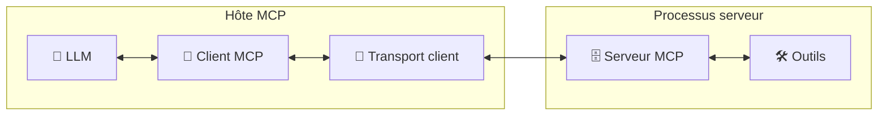

**Le Model Context Protocol (MCP)** représente une avancée majeure dans l'écosystème des **modèles de langage (LLMs)**. Ce protocole standardisé a été introduit par **Anthropic en novembre 2024** et permet aux LLMs d'accéder en temps réel au contexte spécifique des utilisateurs depuis différentes sources de données.

Depuis son lancement, le MCP a connu une adoption remarquablement rapide dans l'industrie. **OpenAI a adopté le standard MCP en mars 2025**, suivi rapidement par **Google en avril 2025** et par **Microsoft lors d'une annonce de Build 2025**, démontrant l'engagement de l'ensemble de l'industrie vers cette standardisation.

Dans cet article, nous allons voir comment implémenter un serveur MCP en TypeScript avec le SDK officiel `@modelcontextprotocol/sdk`. Nous prendrons comme exemple un système de classement spatial avec des astronautes et des planètes, illustrant les concepts fondamentaux du protocole MCP.

<div class="admonition note" markdown="1"><p class="admonition-title">Code source</p>

Le code source complet de ce projet est disponible sur [GitHub](https://github.com/fpasquet/mcp-example). Vous y trouverez tous les fichiers mentionnés dans cet article ainsi que des exemples d'utilisation supplémentaires.
</div>

Mais avant de plonger dans l'implémentation, prenons un moment pour comprendre ce qu'est le MCP et pourquoi il est devenu si important pour les applications modernes basées sur l'IA.

## Qu'est-ce que le Model Context Prodocol (MCP) ?

Le Model Context Protocol est un **standard ouvert** qui définit comment les modèles d'IA peuvent **demander et recevoir du contexte** spécifique à un utilisateur ou à une organisation. Ce protocole facilite l'intégration des LLMs avec des sources de données externes comme les outils de développement, les systèmes CRM, ou les bases de connaissances d'entreprise.

Le MCP s'appuie sur les fondations du **Language Server Protocol (LSP)**, un standard éprouvé dans l'écosystème des éditeurs de code. Cette base solide garantit une architecture robuste et familière aux développeurs, tout en adaptant les concepts aux besoins spécifiques des modèles de langage (LLMs).

<div class="admonition info" markdown="1"><p class="admonition-title">À retenir</p>

Le MCP résout un problème fondamental des LLMs : leur incapacité à accéder aux données privées ou spécifiques d'une organisation. En standardisant la façon dont ces modèles peuvent demander et recevoir du contexte, le MCP permet des intégrations plus profondes et des réponses plus pertinentes.
</div>

## Quelles différences entre le MCP et les APIs traditionnelles ?

La différence fondamentale entre le MCP et les APIs traditionnelles réside dans leur conception et leur finalité :

### APIs traditionnelles : communication machine-machine

Les APIs REST, GraphQL ou RPC sont conçues pour la communication entre applications. Elles suivent des paradigmes techniques stricts :

- **Structure rigide** : Des endpoints prédéfinis, des schémas de données fixes
- **Logique métier explicite** : Le client doit connaître précisément quels endpoints appeler et dans quel ordre
- **Communication statique** : Requête → Réponse, sans adaptation au contexte conversationnel
- **Granularité technique** : Orientées vers les besoins des développeurs, pas des utilisateurs finaux

### MCP : communication LLM-native

Le MCP adopte une approche radicalement différente, pensée pour les capacités cognitives des LLMs :

- **Découverte dynamique** : Les LLMs explorent automatiquement les capacités disponibles
- **Adaptation contextuelle** : Les tools et ressources s'adaptent au contexte de la conversation
- **Sémantique enrichie** : Des descriptions en langage naturel, des métadonnées expressives
- **Orchestration intelligente** : Le LLM détermine quand et comment utiliser chaque fonctionnalité

## Quels sont les bénéfices de créer un MCP Server ?

Un MCP Server offre plusieurs avantages :

- **Contexte dynamique**: Fournir aux modèles d'IA des données à jour provenant de vos systèmes
- **Sécurité améliorée**: Contrôler précisément quelles données sont accessibles au modèle
- **Expérience utilisateur enrichie**: Permettre à l'IA de répondre en se basant sur des données personnalisées
- **Intelligence contextuelle**: Permettre aux LLMs de découvrir et utiliser les fonctionnalités de manière autonome selon les besoins de la conversation

## L'architecture du MCP

Le protocole MCP suit une architecture client-serveur simple :

- **Serveurs MCP** : Exposent des données et des fonctionnalités aux applications IA
- **Clients MCP** : Applications IA qui consomment les ressources et outils des serveurs
- **Transport** : Couche de communication (STDIO / HTTP Streamable / personalisé)
- **Hôtes MCP** : Héberge un LLM et amène une couche d’intelligence en orchestrant dynamiquement l’appel aux bons outils en fonction du contexte de la conversation, permettant ainsi des interactions enrichies et contextualisées, parfois, l’hôte MCP contient aussi le client MCP et le transport. Parmi les clients les plus populaires, on trouve Claude Desktop, Github Copilot, Cursor, Windsurf, Cline, Kilo Code ...



Le processus d'interaction suit un **cycle orchestré** qui transforme une simple question utilisateur en une série d'actions intelligentes et contextualisées :

1. **Demande utilisateur** : L'utilisateur formule une requête naturelle, par exemple : *"Donne-moi les détails sur l'astronaute Alice"*
2. **Analyse cognitive par le LLM** : Le modèle de langage analyse la demande et identifie qu'il a besoin de données externes spécifiques pour fournir une réponse complète et précise
3. **Sélection d'outils** : Le client MCP recherche parmi les outils disponibles celui qui peut traiter cette demande spécifique.
4. **Transmission structurée** : Le client formate la requête selon le protocole *JSON-RPC 2.0* et l'envoie via la couche de transport configurée
5. **Exécution métier** : Le serveur MCP traite la requête en utilisant sa logique métier (interrogation de base de données, appel d'API, calculs, etc.) et prépare une réponse structurée
6. **Retour contextualisé** : Le serveur renvoie les données formatées au client MCP, qui les transmet au LLM
7. **Présentation finale** : Le LLM combine les données reçues avec ses capacités conversationnelles pour générer une réponse naturelle et contextuelle à l'utilisateur

<div class="admonition info" markdown="1"><p class="admonition-title">À retenir</p>

Cette orchestration permet au système de fonctionner de manière **totalement transparente** pour l'utilisateur final. L'utilisateur n'a pas conscience de la complexité technique sous-jacente - il formule simplement sa demande en langage naturel et reçoit une réponse enrichie et contextuelle.

C'est cette **symbiose entre intelligence artificielle et données métier** qui fait la force du protocole MCP.
</div>

## Format de communication : JSON-RPC 2.0

Le protocole MCP utilise **JSON-RPC 2.0** comme format standard pour toutes les communications entre clients et serveurs. Ce choix apporte :

- **Standardisation** : Format bien établi et largement supporté
- **Simplicité** : Structure claire pour les requêtes et réponses
- **Extensibilité** : Facilite l'ajout de nouvelles méthodes et paramètres
- **Interopérabilité** : Compatible avec de nombreux langages et plateformes

Exemple de requête JSON-RPC 2.0 :
```json
{
  "jsonrpc": "2.0",
  "id": 1,
  "method": "tools/call",
  "params": {
    "name": "get_astronaut_details",
    "arguments": {
      "name": "Alice"
    }
  }
}
```

Exemple de réponse JSON-RPC 2.0 :
```json
{
  "jsonrpc": "2.0",
  "id": 1,
  "result": {
    "content": [
      {
        "type": "text",
        "text": "🚀 PROFIL ASTRONAUTE ..."
      }
    ]
  }
}
```

## Choix du transport et des couches de communication

Le choix du transport détermine comment votre serveur MCP communique avec les clients. Trois options principales sont disponibles :

### STDIO (Standard Input/Output)

Le transport STDIO est parfait pour :
- **Applications desktop** : Intégration directe dans Claude Desktop, Cursor, Windsurf
- **Accès système** : Manipulation de fichiers locaux, exécution de commandes système, accès aux ressources de la machine
- **Développement local** : Communication directe sur la même machine
- **Simplicité et performance** : Latence minimale, pas d'exposition réseau

```typescript
// packages/mcp/src/mcp-server-stdio.ts
#!/usr/bin/env node

import { StdioServerTransport } from '@modelcontextprotocol/sdk/server/stdio.js';

import { McpServer } from './mcp-server.js';

async function run() {
  const mcpServer = new McpServer();
  const transport = new StdioServerTransport();
  await mcpServer.connect(transport);
  console.error('MCP server started successfully on stdio');
}

run().catch((error) => {
  console.error('Fatal error in run():', error);
  process.exit(1);
});
```

### HTTP Streamable

Le transport HTTP Streamable (qui remplace l'ancien SSE) convient mieux pour :

- **Applications web** : Intégration dans des interfaces web modernes
- **Déploiement distant** : Serveurs hébergés à distance accessibles via HTTP
- **Multi-clients** : Support de plusieurs connexions simultanées
- **Streaming bidirectionnel** : Communication en temps réel avec streaming des réponses
- **Compatibilité web** : Fonctionne avec les standards HTTP modernes

```typescript
// apps/mcp-server-http/src/mcp-server-http.ts
import { registerMcpServerHttp } from '@repo/mcp/utils/register-mcp-server-http';
import cors from 'cors';
import express from 'express';

const PORT = process.env.PORT ?? 3000;
const app = express();

app.use(cors());
registerMcpServerHttp(app);

app.listen(PORT, () => {
  console.error(`MCP HTTP server started on port ${PORT}`);
  console.error(`HTTP endpoint: http://localhost:${PORT}/mcp`);
});
```

### Transport personnalisé

Vous pouvez également créer votre propre couche de transport en implémentant les interfaces MCP. Cela permet d'adapter la communication à vos besoins spécifiques (TCP/Unix Sockets, protocoles propriétaires, etc.).

<div class="admonition info" markdown="1"><p class="admonition-title">À retenir</p>

- Utilisez **STDIO** pour les intégrations desktop, l'accès aux ressources système locales et un développement rapide
- Préférez **HTTP Streamable** pour des architectures web ou des déploiements cloud ou des besoins de scalabilité
- **Transport custom** : pour des besoins de communication spécifiques
- Tous les transports utilisent le format **JSON-RPC 2.0** pour assurer la compatibilité et la standardisation
</div>

## Les trois fonctionnalités piliers du Model Context Protocol

Un serveur MCP peut exposer trois types de fonctionnalités :

- **Tools** : Fonctions que les LLM peuvent appeler pour effectuer des actions
- **Resources** : Données structurées accessibles aux LLM (documentation, bases de connaissances)
- **Prompts** : Templates de prompts réutilisables avec paramètres dynamiques

## Cas d'usages d'implémentations existantes

Plusieurs grandes entreprises ont déjà adopté le MCP :

- **Atlassian** avec son MCP Server pour Jira et Confluence
- **GitHub** avec son intégration pour les référentiels de code
- **Notion** pour l'accès à ses bases de connaissances
- **Salesforce** pour l'accès aux données CRM

Ces implémentations permettent aux LLMs d'accéder à des données spécifiques comme les tickets Jira, les pull requests GitHub, ou les documents Notion, tout en respectant les permissions des utilisateurs.

## Exemple d'implémentation pratique du serveur MCP

### Structure de base du serveur

Commençons par créer la classe principale de notre serveur MCP :

```typescript
// packages/mcp/src/mcp-server.ts
import { Server } from '@modelcontextprotocol/sdk/server/index.js';

export class McpServer extends Server {
  constructor() {
    super(
      {
        name: 'spatial-ranking-server',
        version: '1.0.0',
      },
      {
        capabilities: {
          prompts: {},
          resources: {},
          tools: {},
        },
      }
    );

    this.setupToolHandlers();
    this.setupResourceHandlers();
    this.setupPromptHandlers();
  }

  // Les méthodes d'implémentation suivront...
}
```

Cette classe hérite de la classe `Server` du SDK MCP et déclare ses capacités lors de l'initialisation. Les trois méthodes de configuration organisent la logique selon les trois piliers du protocole MCP.

### Implémentation des Tools

Les tools constituent l'élément le plus dynamique et interactif de votre serveur MCP. Ils permettent aux LLMs d'effectuer des actions concrètes et d'obtenir des résultats en temps réel. Contrairement aux ressources qui sont statiques, les tools peuvent modifier l'état de votre système, effectuer des calculs, ou interagir avec des APIs externes.

L'implémentation des tools suit un modèle en trois étapes : définition du schéma de validation, implémentation de la logique métier, et enregistrement des handlers sur le serveur. Cette approche garantit une validation robuste des entrées et une gestion d'erreur cohérente.

#### Définition des schémas de validation

```typescript
// packages/mcp/src/tools.ts
import { z } from 'zod';
import { zodToJsonSchema } from 'zod-to-json-schema';

export const SearchAstronautSchema = z.object({
  astronautName: z.string().describe("Nom de l'astronaute à rechercher"),
});

export const AddPointsToAstronaut = z.object({
  astronautName: z.string().describe("Nom de l'astronaute"),
  points: z.number().describe('Nombre de points à ajouter'),
  reason: z.string().describe("Raison de l'attribution des points").optional(),
});

export const TOOLS = [
  {
    description: 'Affiche le classement actuel des planètes par points',
    inputSchema: zodToJsonSchema(z.object({})),
    name: 'get_planet_rankings',
  },
  {
    description: "Recherche d'un astronaute par son nom",
    inputSchema: zodToJsonSchema(SearchAstronautSchema),
    name: 'search_astronaut',
  },
  {
    name: 'add_points_to_astronaut',
    description: 'Ajoute des points à un astronaute et met à jour son grade',
    inputSchema: zodToJsonSchema(AddPointsToAstronaut),
  },
] as const;
```

#### Implémentation des fonctions tools

```typescript
// packages/mcp/src/tools.ts
export const getPlanetRankings = () => {
  const planetsWithRanking = services.getPlanetsWithRanking();

  return {
    content: [
      {
        text:
          `🏆 CLASSEMENT DES PLANÈTES - SAISON GALACTIQUE 2025\n\n` +
          planetsWithRanking
            .map(
              (p) =>
                `${p.position}. ${p.name}\n   Points: ${p.points.toLocaleString()} | Astronautes: ${p.astronauts.length}`
            )
            .join('\n\n') +
          `\n\n⭐ ${planetsWithRanking[0]!.name} mène la course !`,
        type: 'text',
      },
    ],
  };
};

export const searchAstronaut = ({ astronautName }: z.infer<typeof SearchAstronautSchema>) => {
  try {
    const astronaut = services.searchAstronaut({ astronautName });

    if (!astronaut) throw new Error(`Astronaut "${astronautName}" not found`);

    return {
      content: [
        {
          text:
            `🚀 PROFIL ASTRONAUTE\n\n` +
            `👤 Nom: ${astronaut.name}\n` +
            `🌟 Grade: ${astronaut.rank.name}\n` +
            `🪐 Planète: ${astronaut.planet.name}\n` +
            `🏆 Points personnels: ${astronaut.points}\n` +
            `💫 Contribution pour ça planète: ${((astronaut.points / astronaut.planet.points) * 100).toFixed(1)}%`,
          type: 'text',
        },
      ],
    };
  } catch (error) {
    return {
      content: [
        {
          text: `❌ ${error instanceof Error ? error.message : 'Unknown error'}`,
          type: 'text',
        },
      ],
    };
  }
};

export const addPointsToAstronaut = ({ astronautName, points, reason }: z.infer<typeof AddPointsToAstronaut>) => {
  try {
    const astronaut = services.searchAstronaut({ astronautName });

    if (!astronaut) {
      throw new Error(`Astronaut "${astronautName}" not found`);
    }

    const astronautUpdated = services.addRewardToAstronaut({ astronautId: astronaut.id, points, reason });

    const gradeChange =
      astronaut.rank.name !== astronautUpdated.rank.name
        ? `\n🎉 PROMOTION: ${astronaut.rank.name} → ${astronautUpdated.rank.name} !`
        : '';

    return {
      content: [
        {
          type: 'text',
          text:
            `✅ POINTS ATTRIBUÉS\n\n` +
            `👤 Astronaute: ${astronautUpdated.name}\n` +
            `➕ Points ajoutés: +${points}\n` +
            `📝 Raison: ${reason}\n` +
            `🏆 Total personnel: ${astronautUpdated.points} pts\n` +
            gradeChange,
        },
      ],
    };
  } catch (error) {
    return {
      content: [
        {
          text: `❌ ${error instanceof Error ? error.message : 'Unknown error'}`,
          type: 'text',
        },
      ],
    };
  }
};
```

#### Implémentation des handlers sur le serveur

```typescript
// packages/mcp/src/server.ts
private setupToolHandlers() {
  this.setRequestHandler(ListToolsRequestSchema, () => ({
    tools: TOOLS,
  }));

  this.setRequestHandler(CallToolRequestSchema, (request) => {
    switch (request.params.name) {
      case 'search_astronaut': {
        const args = SearchAstronautSchema.parse(request.params.arguments);
        return searchAstronaut(args);
      }
      case 'add_points_to_astronaut': {
        const args = AddPointsSchema.parse(request.params.arguments);
        return addPointsToAstronaut(args);
      }
      case 'get_planet_rankings':
        return getPlanetRankings();
      default:
        throw new Error(`Tool inconnu: ${request.params.name}`);
    }
  });
}
````

<div class="admonition tip" markdown="1"><p class="admonition-title">Bonnes pratiques</p>

- **Validation stricte** : Utilisez Zod pour valider tous les paramètres d'entrée et fournir des messages d'erreur clairs
- **Descriptions détaillées** : Rédigez des descriptions précises pour guider les LLMs dans l'utilisation appropriée de chaque tool
- **Gestion d'erreur robuste** : Implémentez une gestion d'erreur explicite avec des messages utilisateur compréhensibles
- **Idempotence** : Concevez vos tools pour être idempotents quand c'est possible (même entrée = même résultat)
- **Performance** : Optimisez les temps de réponse, les LLMs sont sensibles à la latence
- **Atomicité** : Chaque tool doit effectuer une action unique et bien définie
- **Sécurité** : Validez les permissions et l'accès aux données sensibles
</div>

### Implémentation des ressources

Les ressources constituent la mémoire documentaire de votre serveur MCP. Contrairement aux tools qui exécutent des actions, les ressources fournissent un accès structuré à des données de référence, de la documentation, ou du contenu statique que les LLMs peuvent consulter pour enrichir leurs réponses.

Les ressources sont particulièrement utiles pour exposer des bases de connaissances, des documentations techniques, des guides d'utilisation, ou des données de configuration. Elles permettent aux LLMs d'accéder à ces informations sans avoir à les répéter dans chaque conversation, économisant ainsi des tokens et garantissant la cohérence des informations.

#### Définition des schémas de validation

```typescript
// packages/mcp/src/resources.ts
export const RESOURCES = [
  {
    name: 'rules.md',
    description: 'Règles complètes du système de classement spatial',
    mimeType: 'text/markdown',
    uri: 'file://rules.md',
  },
];
```

#### Implémentation des handlers sur le serveur

```typescript
// packages/mcp/src/server.ts
private setupResourceHandlers() {
  this.setRequestHandler(ListResourcesRequestSchema, () => ({
    resources: RESOURCES,
  }));

  this.setRequestHandler(ReadResourceRequestSchema, (request) => {
    const { uri } = request.params;

    if (uri === 'file://rules.md') {
      return {
        contents: [{
          mimeType: 'text/markdown',
          text: readFileSync('./resources/rules.md', 'utf-8'),
          uri,
        }],
      };
    }

    throw new Error(`Ressource inconnue: ${uri}`);
  });
}
```

<div class="admonition tip" markdown="1"><p class="admonition-title">Bonnes pratiques</p>

- **Structure cohérente** : Organisez vos ressources avec des URIs logiques et hiérarchiques (ex: `file://docs/api.md`, `db://schema/users`)
- **Métadonnées riches** : Fournissez des descriptions détaillées et des types MIME appropriés
- **Versioning** : Intégrez la gestion de versions dans vos URIs quand nécessaire (`file://docs/v2/api.md`)
- **Mise en cache** : Implémentez une stratégie de cache pour les ressources coûteuses à générer
- **Granularité adaptée** : Divisez les gros documents en sections logiques plutôt que d'exposer des fichiers monolithiques
- **Formats standardisés** : Privilégiez les formats standards (Markdown, JSON, XML) pour une meilleure interprétation
- **Gestion des permissions** : Vérifiez les droits d'accès avant d'exposer des ressources sensibles
</div>

### Implémentation des Prompts

Les prompts représentent l'aspect le plus créatif du protocole MCP. Ils permettent de créer des templates de conversation intelligents et réutilisables qui peuvent être paramétrés dynamiquement. Ces templates offrent une approche standardisée pour générer des prompts complexes adaptés à des contextes spécifiques.

Les prompts MCP sont particulièrement puissants car ils peuvent intégrer des données en temps réel, permettant de créer des conversations contextualisées et personnalisées. Ils servent de point d'entrée pour des workflows complexes, des analyses automatisées, ou des rapports personnalisés.

#### Définition des schémas de validation

```typescript
// src/prompts.ts
export const WeeklyReportSchema = z.object({
  weekNumber: z.string()
    .describe('Numéro de la semaine')
    .optional()
    .default(getCurrentWeek()),
});

export const PROMPTS = [
  {
    name: 'weekly_report',
    description: 'Génère un rapport hebdomadaire des performances',
    arguments: [{
      name: 'weekNumber',
      description: 'Numéro de la semaine (optionnel)',
      required: false,
    }],
  },
] as const;
```

### Implémentation des fonctions de prompts

```typescript
// src/prompts.ts
export const weeklyReport = (weekNumber: string) => {
  const rankings = services.getPlanets().sort((a, b) => b.points - a.points);
  const topAstronauts = services.getAstronauts().slice(0, 3);

  return {
    description: `Rapport hebdomadaire S${weekNumber}`,
    messages: [{
      role: 'user',
      content: {
        type: 'text',
        text: `Génère un rapport professionnel pour la semaine ${weekNumber}.

Données actuelles:
- Classement: ${rankings.map(p => `${p.name} (${p.points} pts)`).join(', ')}
- Top 3: ${topAstronauts.map(a => `${a.name} (${a.points} pts)`).join(', ')}

Format: titre accrocheur, classement avec évolution, performances individuelles.`,
      },
    }],
  };
};
```

### Implémentation des handlers sur le serveur

```typescript
// packages/mcp/src/server.ts
private setupPromptHandlers() {
  this.setRequestHandler(ListPromptsRequestSchema, () => {
    return {
      prompts: PROMPTS,
    };
  });
  this.setRequestHandler(GetPromptRequestSchema, (request) => {
    try {
      switch (request.params.name) {
        case 'weekly_report': {
          const args = GetWeeklyReportSchema.parse(request.params.arguments);
          return weeklyReport(args.weekNumber);
        }
        default:
          throw new Error(`Unknown prompt: ${request.params.name}`);
      }
    } catch (error) {
      if (error instanceof z.ZodError) {
        throw new Error(`Invalid input: ${JSON.stringify(error.errors)}`);
      }
      throw error;
    }
  });
}
```

<div class="admonition tip" markdown="1"><p class="admonition-title">Bonnes pratiques</p>

- **Paramétrage flexible** : Concevez des prompts avec des paramètres optionnels et des valeurs par défaut
- **Contexte riche** : Intégrez automatiquement les données pertinentes du système dans vos templates
- **Instructions claires** : Rédigez des prompts avec des instructions explicites sur le format de sortie attendu
- **Modularité** : Créez des prompts composables qui peuvent être combinés pour des workflows complexes
- **Gestion des erreurs** : Prévoyez des fallbacks quand les données attendues ne sont pas disponibles
- **Optimisation des tokens** : Équilibrez richesse du contexte et efficacité en tokens
- **Tests rigoureux** : Testez vos prompts avec différents jeux de paramètres pour garantir la robustesse
- **Documentation** : Documentez les cas d'usage et les paramètres de chaque prompt template
</div>

## Test et debug avec l'inspecteur MCP

L'inspecteur MCP est un outil essentiel pour tester et déboguer votre serveur. Il fournit une interface web interactive pour explorer vos tools, ressources et prompts.

### Démarrage de l'inspecteur

```bash
# Lancement avec votre serveur
npx @modelcontextprotocol/inspector node path/to/dist/mcp-server-stdio.js
```

L'inspecteur se lance sur `http://localhost:6274` et affiche une interface similaire à celle-ci :


### Test des Tools

L'onglet "Tools" permet de tester chaque fonction individuellement. Voici un exemple de test du tool `search_astronaut` :


L'inspecteur génère automatiquement des formulaires basés sur vos schémas Zod et affiche les réponses formatées.

### Exploration des ressources

L'onglet "Resources" liste toutes vos ressources disponibles et permet de les consulter directement :


### Test des prompts

L'onglet "Prompts" permet de tester vos templates avec différents paramètres :


<div class="admonition tip" markdown="1"><p class="admonition-title">Bonnes pratiques</p>

1. **Développez** vos fonctionnalités MCP
2. **Testez** avec l'inspecteur pour valider le comportement
3. **Déboguez** les erreurs directement dans l'interface
4. **Intégrez** avec votre client MCP (Claude Desktop, etc.)
</div>

## Intégration avec Claude Desktop

### Configuration

Ajoutez votre serveur dans le fichier de configuration de Claude Desktop :

```json
{
  "mcpServers": {
    "spatial-system": {
      "command": "node",
      "args": ["path/to/your/dist/mcp-server-stdio.js"]
    }
  }
}
```

### Exemples d'utilisation en conditions réelles

Voici quelques exemples d'interactions avec Claude Desktop utilisant notre serveur MCP :

#### 1. Consultation du classement

**Prompt :** "Peux-tu me montrer le classement actuel des planètes ?"


Claude appelle automatiquement le tool `get_planet_rankings` et présente les résultats de manière engageante.

#### 2. Recherche d'astronaute

**Prompt :** "Donne-moi les détails sur l'astronaute Alice"


Le tool `search_astronaut` est appelé avec le paramètre `{ "astronautName": "Alice" }`.

#### 3. Attribution de points

**Prompt :** "Ajoute 50 points à Alice pour sa mission réussie"


Claude utilise le tool `add_points_to_astronaut` avec les paramètres :
```json
{
  "astronautName": "Alice",
  "points": 50,
  "reason": "mission réussie"
}
```

#### 4. Génération de rapport

**Prompt :** "Génère-moi le rapport hebdomadaire de cette semaine"


Le prompt `weekly_report` est listé automatiquement, mais ils sont conçues pour être contrôlées par l'utilisateur, ce qui signifie que vous devez l'ajouter manuellement à votre conversation pour que Claude l'utilise dans sa génération de rapport personnalisé.

#### 5. Consultation des règles

**Prompt :** "Explique-moi les règles du système de gamification"


La ressource `rules.md` est listée automatiquement, mais vous devez l'ajouter manuellement à votre conversation pour que Claude puisse consulter son contenu et fournir une explication complète.

### Conversation publique d'exemple

Vous pouvez voir une conversation complète démontrant toutes ces fonctionnalités dans cette [conversation publique Claude Desktop](https://claude.ai/share/0a7d8e6a-7b8c-4105-96b8-8ec1c5111ea9).

<div class="admonition info" markdown="1"><p class="admonition-title">À retenir</p>

- Les **tools** sont appelés automatiquement par Claude selon le contexte
- Les **resources** et **prompts** sont listés automatiquement mais doivent être ajoutés manuellement à la conversation
- Claude comprend intelligemment quel tool utiliser sans instruction explicite
</div>

## Conclusion

Le MCP représente bien plus qu'une simple évolution technique : c'est un **changement paradigmatique** dans la façon dont les LLMs interagissent avec nos systèmes d'information. Contrairement aux **APIs traditionnelles** qui nécessitent une programmation explicite pour chaque cas d'usage, le MCP permet aux modèles de langage de **découvrir, comprendre et utiliser intelligemment les ressources disponibles selon le contexte** de la conversation.

Le MCP apporte ainsi une **expérience utilisateur** plus fluide, plus naturelle et plus puissante : l’IA ne se contente plus de répondre à une question, elle agit comme un **agent intelligent**, capable de comprendre l’environnement métier, de naviguer dans des sources complexes, et d’automatiser des tâches à forte valeur ajoutée.

En somme, le **MCP ne remplace pas les API traditionnelles, mais les complète** et les transcende, en s’adaptant aux besoins exprimés. Il marque le passage d’un modèle statique à un **modèle conversationnel**, modulaire et interopérable.

Grâce au **SDK TypeScript**, il devient possible de créer des **serveurs MCP** robustes, capables d’exposer des **fonctionnalités métier**, des données contextuelles ou des outils dynamiques via une **interface standardisée**.

<div class="admonition info" markdown="1"><p class="admonition-title">À retenir</p>

- **Tools**: largement pris en charge par les hôtes et clients MCP, ils sont appelés automatiquement pour exécuter des actions dynamiques.
- **Resources**: encore peu ou partiellement supportées, elles doivent généralement être ajoutées manuellement pour fournir documentation et données de référence.
- **Prompts**: peu pris en charge également, ils sont utiles comme templates réutilisables mais nécessitent souvent une configuration manuelle.
- **Validation**: assurée par Zod pour garantir la robustesse des données échangées.
- **Inspecteur MCP**: outil essentiel pour le développement, le débogage et l’inspection en temps réel des agents et de leurs interactions.
</div>

Dans un **prochain article**, nous explorerons comment créer des clients MCP personnalisés et comment intégrer MCP dans des applications web modernes avec des frameworks comme Next.js.

## Ressources supplémentaires

- [Documentation officielle MCP](https://modelcontextprotocol.io/)
- [Spécification du protocole MCP](https://spec.modelcontextprotocol.io/)
- [Inspecteur MCP](https://github.com/modelcontextprotocol/inspector)
- [Exemples de serveurs MCP](https://github.com/modelcontextprotocol)
