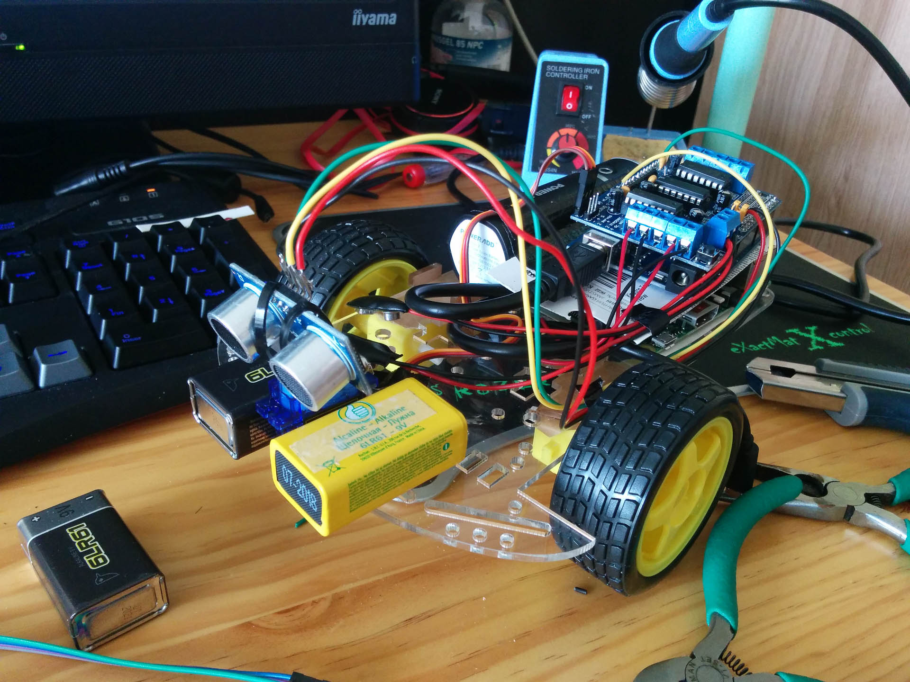
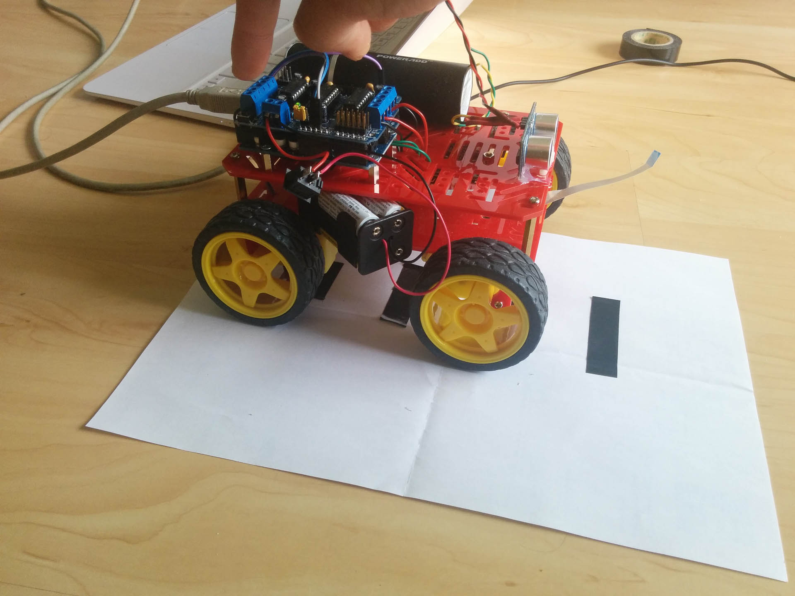
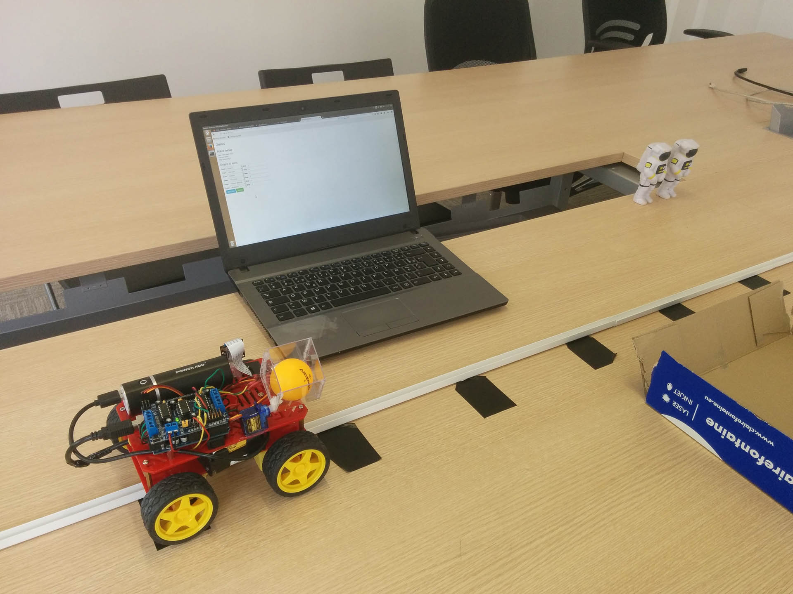
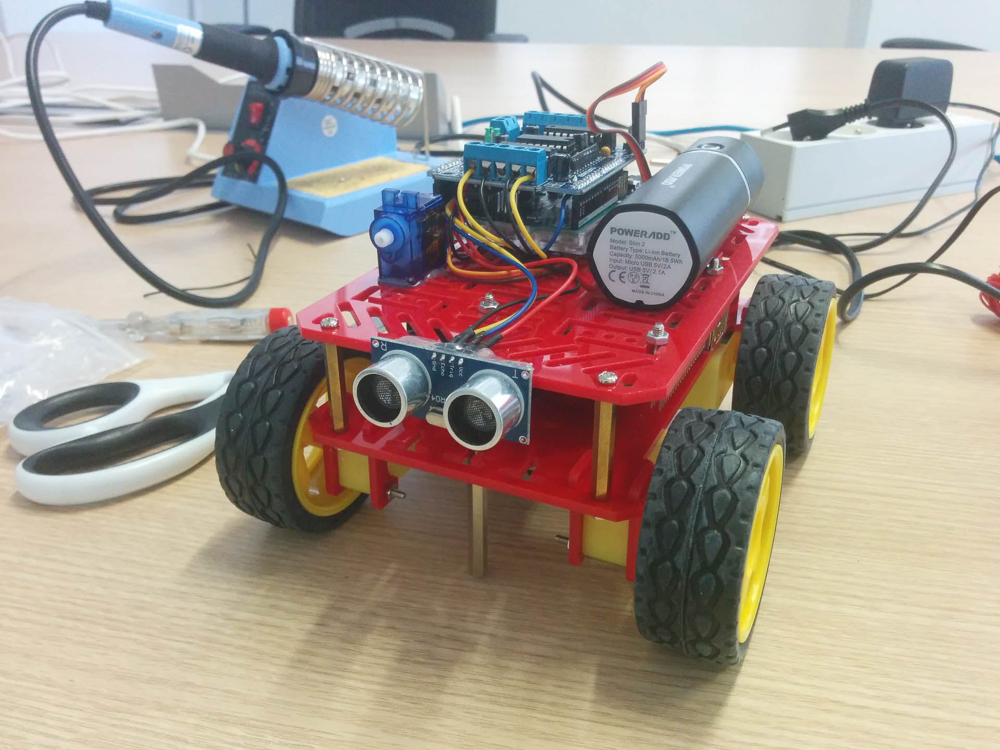
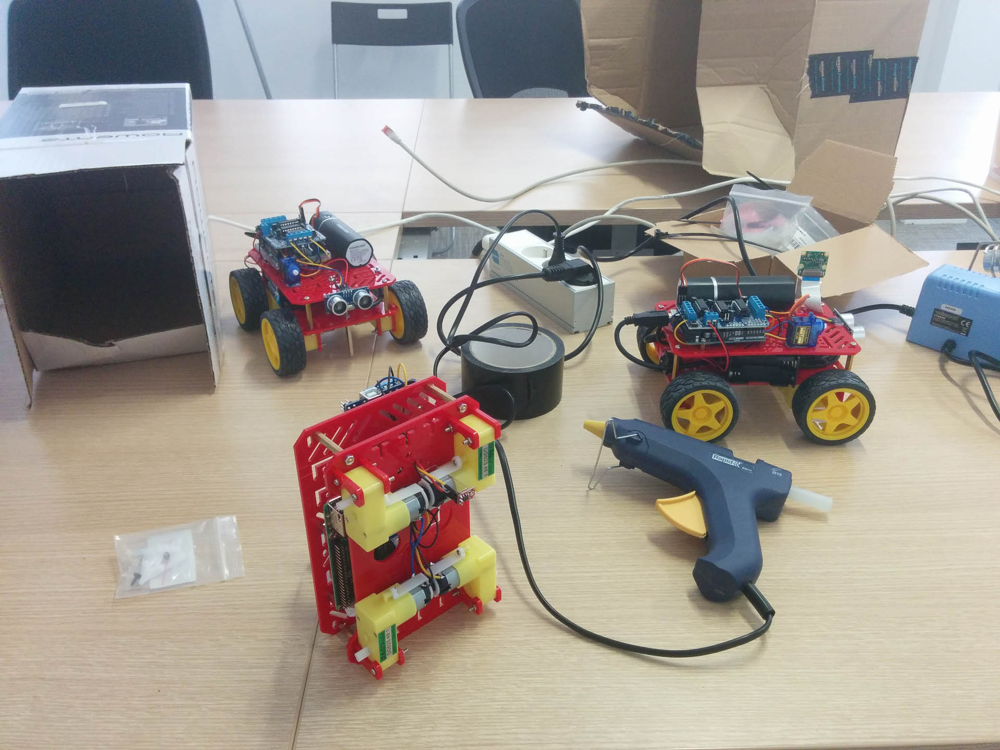
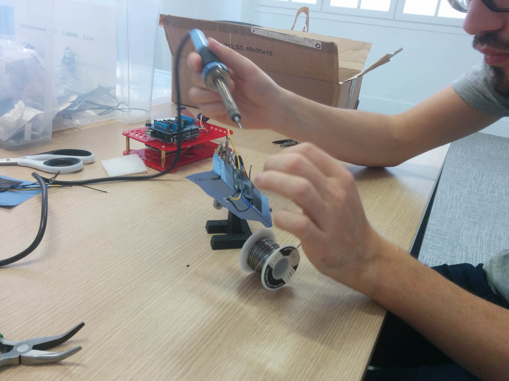
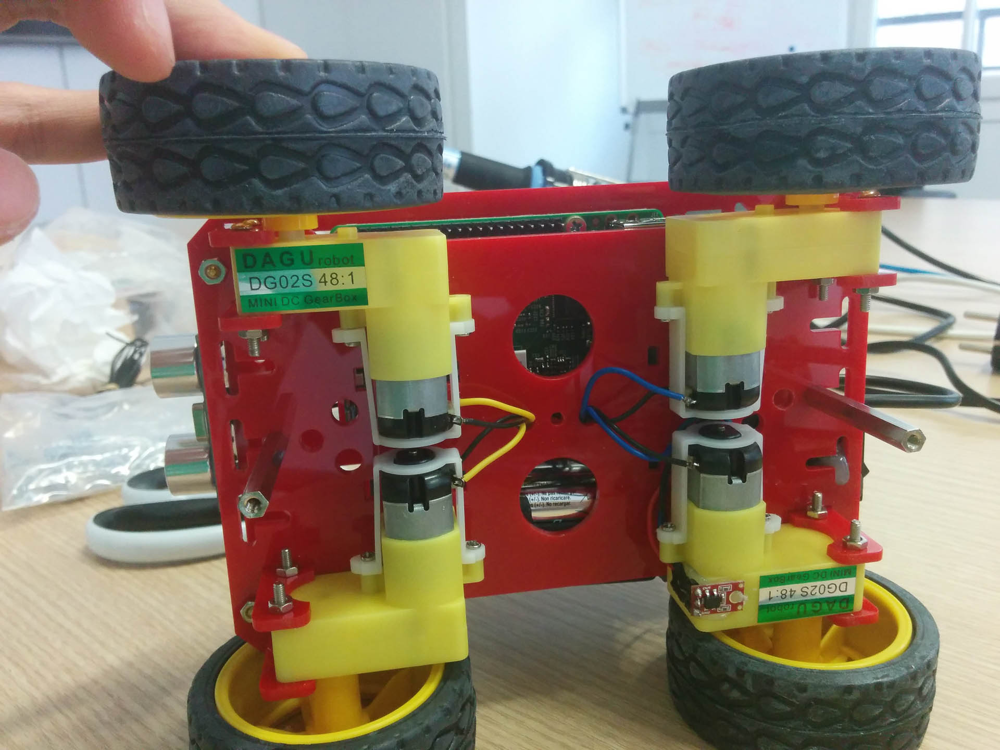
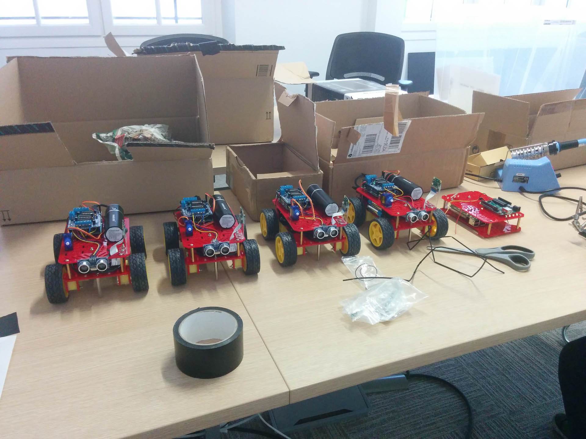

Le 6 avril a eu lieu le plus grand hackaton organisé par eleven-labs: Wilson Coding Battlespace. Avec de nombreux challenges tous plus fous les uns que les autres, je vais vous parler d'un en particulier: Roverity.

### Une idée qui germe

L'idée du challenge Roverity est venue assez naturellement. Notre univers est principalement centré sur le monde de l'espace. Dans l'histoire de l'espace, il y a les Hommes et... les robots. Grâce au robot, il est beaucoup plus facile pour les Hommes d'explorer les planètes voisines.

Pour ce challenge, nous allons donc construire un robot qui serait semblable aux robots des missions martiennes.

Nous avons un prémice d'idée. Commençons à la développer.

Notre robot, comme les robots des missions martiennes, doit se déplacer dans un espace dans un but de reconnaissance. Il va prendre des photos, prélever des éléments et les déposer. Voilà l'idée initiale.

Une fois l'idée plus claire, je pouvais passer à la réalisation. Eleven-Labs est spécialisé dans les technologies Javascript et PHP. Ce robot devait refléter cette expertise. Il devait donc être programmable dans ces langages. Cette dernière contrainte rend la réalisation du challenge assez particulière. Fallait-il prendre un robot du commerce et l'adapter à notre besoin ? Ou alors construire notre propre robot ?

J'ai fait quelques recherches sur des robots du commerce existants. Il y en avait des bons, mais je ne savais pas s'ils étaient facilement personnalisables. Etant donné l'investissement, il fallait être sûr de pouvoir y répondre. J'ai donc décidé de concevoir et de construire le robot par moi-même. Ainsi, j'étais sûr des différents composants et j'avais la pleine maîtrise des logiciels embarqués (vive l'open source!).

 Mes connaissances en terme de robotique étaient assez basiques. J'ai également des connaissances basiques en électronique et en Arduino. Malgré ce bagage modeste, j'avais une vision très claire des éléments à mettre en place.

### Phase de recherche et developpement

Avec ce projet, nous avions des réunions mensuelles. Je pouvais appliquer un des principe de l'agilité: fournir un livrable fonctionnel à chaque itération. Comme les cycles duraient 1 mois, ça tombait bien.

J'ai commencé à réfléchir sur les composants. Je savais que j'avais besoin d'une partie pour gérer les mouvements du robot. J'ai opté pour un chassis à 2 roues car c'est économique pour un premier prototype. Ensuite en électronique, j'ai pris un Arduino et une carte de contrôle pour les moteurs (un bouclier basé sur des ponts en H L293D). Ce choix était naturel car il existe de nombreux tutoriels à ce sujet. Ensuite, je devais faire en sorte que ce soit programmable en PHP et NodeJS. Malheuresement, l'Arduino ne se programme qu'en C/C++. Comment faire ? J'ai donc créé une API en utilisant la liaison série. La liaison série de l'Arduino était le point d'entrée pour faire faire des actions au robot. L'avantage d'utiliser une liaison série est que c'est universel. A l'image du protocole HTTP, la liaison série est facilement exploitable. Il suffit d'avoir la documentation de l'API pour faire des actions. L'ajout d'un Raspberry Pi dans le robot va permettre de communiquer avec l'Arduino en liaison série. L'avantage d'un Raspberry Pi est sa taille. Il rentre parfaitment dans les dimensions du robot. De plus, il y a une liaison Wifi embarqué et un système d'exploitation complet.

```
                                           Robot roverity

+-------------------------------+------------------------------------+--------------------------+
|                               |                                    |                          |
|                               |                                    |                          |
|                               |                                    |                          |
|                               |                                    |                          |
|                               |      +-----------------------+     |                          |
|                               |      |                       |     |                          |
|                               |      |  Capteur de distance  |     |                          |
|                               |      |                       |     |                          |
|                               |      +------------+----------+     |                          |
|                               |                   |                |                          |
|                               |                   |                |                          |
|   +----------------+          |          +--------+-----+          |  +-------------------+   |
|   |                |  Liaison |  série   |              |          |  |                   |   |
|   |  Raspberry Pi  +<------------------->+   Arduino    +-------------+ Contrôleur moteur |   |
|   |                |          |          |              |          |  |                   |   |
|   +----------------+          |          +-------+------+          |  +---------+---------+   |
|                               |                  |                 |            |             |
|                               |                  |                 |            |             |
|                               |                  |                 |            |             |
|                               |      +-----------+----------+      |      +-----v------+      |
|                               |      |                      |      |      |            |      |
|                               |      | Servomoteur + godet  |      |      |  Moteurs   |      |
|                               |      |                      |      |      |            |      |
|                               |      +----------------------+      |      +------------+      |
|                               |                                    |                          |
|       Partie logique          |                                    |     Partie Puissance     |
|      programmable par         |           Arduino expose           |                          |
|        l'utilisateur          |              une API               |                          |
|                               |                                    |                          |
|                               |                                    |                          |
+-------------------------------+------------------------------------+--------------------------+

```

Voilà, j'avais tous les éléments. J'ai lancé le premier prototype assez rapidement pour montrer le potentiel de l'idée. Tout d'abord dans sa forme, puis dans la fonctionnalité. Avoir le produit sous les yeux dès la première itération a permis de lancer d'autres idées. Il y a eu l'ajout d'un capteur de distance pour qu'il évite les obstacles et un godet pour récupérer/déposer des objets.



A partir de là j'ai commencé à expérimenter la partie logicielle. C'était le début des difficultés.

#### Avance petit robot

Le robot était parfait dans notre esprit. Maintenant il fallait le faire bouger. Après avoir fait tout le câblable, j'ai commencé par expérimenter la partie Arduino uniquement. J'ai chargé des programmes de base qui faisaient avancer le robot en ligne droite. Je me suis aperçu que le robot n'avançait pas droit. Pourquoi ? J'ai longtemps cherché. Il y avait 2 réponses : 
- la répartition de la charge qui n'était pas égale sur le chassis
- les moteurs

Pour le premier point, j'ai tenté d'équilibrer les masses. C'était un bon début, mais insuffisant. Le gros problème était au niveau des moteurs. Le problème des moteurs à courant continu c'est qu'il ne tournent pas tous à la même vitesse. Certains moteurs avaient un peu plus de puissance. Ils tournaient donc un peu plus vite. Pour résoudre ce problème, il fallait utiliser des encodeurs de roues. Cela permettait de compter le nombre de tours des roues et de calculer un taux de correction. J'ai tenté de mettre en place la solution, mais les roues codeuses fournies avec le robot n'étaient pas assez efficaces. Il y avait des sauts de compte.

Je me suis tourné vers un chassis à 4 roues en pensant que ça allait mieux fonctionner. C'était beaucoup mieux, mais encore insuffisant. Il y avait toujours une légère déviation. Le robot avançait mais ne revenait pas à sa position de départ.

Au fur et à mesure des expérimentations et des démonstrations, l'idée que le robot puisse faire un parcours libre dans un espace a été abandonnée. Avec ce nouveau prototype, le robot pouvait avancer et reculer en ligne droite assez efficacement. Mais ce n'était pas une ligne droite parfaite. Je devais trouver un système de guidage pour le robot. J'ai tout d'abord pensé aux robots suiveur de ligne. Avec des capteurs infrarouges, ils suivent une ligne pour rester droit. Cette idée a été améliorée et simplifiée : un rail de guidage. Au début c'était pour les roues, mais j'ai pensé au tram à rail central (voir réf 3). La solution était complètement compatible avec le robot.

J'ai acheté un profilé en U dans un magasin de bricolage et j'ai fixé deux vis le long de l'axe central du robot. J'ai reproduit le système de guidage avec un rail central.



#### Des actions en chemin

Avancer et reculer le long d'un rail est une bonne chose. Mais le robot s'inscrit dans un scénario d'exploration. Comment le transposer sur une ligne droite ?

Avec le capteur et le godet, nous avons imaginé un parcours. Il y avait un réceptacle sur un côté pour recevoir un objet en provenance du godet. Il y avait une boite en bout de piste pour symboliser un obstacle qui sera capté par le capteur de distance. Nous avons mis un Wilson sur le côté pour qu'il soit pris en photo par la caméra.

Suite à l'expérience précédente, je ne pouvais pas compter sur les roues codeuses pour calculer la distance à parcourir. J'ai donc imaginé un système de marqueur au sol. Ces marqueurs étaient disposés à une distance régulière. Ainsi, le robot pouvait se repérer facilement. Les marqueurs sont captés par l'Arduino via un module infrarouge (voir réf 4.).

A ce stade, le robot était capable d'avancer, reculer, s'arrêter et de compter le nombre de pas qu'il a fait.




Et la partie logiciel ?

#### Une API sur la liaison série

Une fois la partie matériel réglée et fiable, je devais m'attaquer au logiciel. L'objectif est de construire une API sur la liaison série de l'Arduino. Cette API permet d'envoyer des ordres qui seront exécutés par la partie Arduino (avancer, reculer, faire les actions).

Lire les données en liaison série avec un Arduino est assez simple. Le plus difficile est d'informer en retour l'état interne du robot tout en étant capable de recevoir d'autres ordres. Je pouvais laisser la liaison série accepter tous les ordres, mais si le robot était en train de faire une action et que deux ordres arrivent en même temps, il était probable qu'un des ordres soit ignoré.

Pour résoudre ce problème de concurrence, j'ai imposé une régle : tant que le robot a une action en cours, tous les ordres envoyés seront ignorés. Un seul état permettait au robot de répondre à un ordre: READY.

Pour rappel, le robot est capable de compter les pas à faire. L'Arduino détenait un compteur qu'il décrémentait. La spécification de l'API était donc assez simple. L'action à faire et le nombre de pas. Exemple `f4`, "forward 4 steps".

J'ai construit l'API dans ce sens. En réponse, l'Arduino renvoyait sur la liaison série l'action en cours, l'état de son compteur interne et la valeur de la mesure de distance. Cette dernière était toujours renvoyée, cela simplifiait le développement. Dans le cas des actions sans compteur (verser le godet), l'action était immédiatement prise en compte et l'Arduino renvoyait immédiatement un état READY.

```c
void loop()
{
  printState();

  // if has step, do not allow more instruction
  if (step > 0) {
    decrementStepCounter();

    return;
  }

  // if step is zero, but has previous direction
  if (step == 0 && direction != 0) {
    resetState();
    flushSerial();

    return;
  }

  readSerial();

  if (direction == 'f') {
    moveForward();
    return;
  }

  if (direction == 'b') {
    moveBackward();
    return;
  }

  if (direction == 's') {
    stop();
    return;
  }

  if (direction == 'd') {
    godetDrop();
    return;
  }

  if (direction == 'u') {
    godetUp();
    return;
  }

  if (direction == 'm') {
    readDistance();
    return;
  }
}
```

Simple n'est-ce pas ? :)

Passons maintenant à la seconde partie : communiquer avec l'Arduino avec NodeJS et PHP.

#### Langage agnostique

La grande force de ce robot est de pouvoir le commander dans tous les langages. Comme dit plus haut, la liaison série est un protocole universel. Il existe donc une libraire en NodeJS et en PHP.

Pour NodeJS, c'était assez simple. La librairie était toute faite et je la connaissait déjà : [node-serialport](https://github.com/EmergingTechnologyAdvisors/node-serialport)

Pour PHP, c'était un peu plus compliqué. Qui aurait l'idée d'utiliser du PHP pour communiquer en série alors qu'avec le python c'est beaucoup plus fiable ? :). Il existe une extension en PHP pour faciliter la communication avec une liaison série : [http://pecl.php.net/package/dio](http://pecl.php.net/package/dio) mais par moment, la liaison était coupée. Je me suis mis en quête d'une librairie en PHP, mais je n'ai pas trouvé. J'ai réussi a trouver quelques informations sur des forums, mais ce n'était pas concluant. Si ça n'existe pas, alors je devais la créer. D'après les informations que j'ai trouvé, il est possible de considérer la liaison série comme un fichier. D'ailleurs, sur un système GNU/Linux, tout est fichier. Et donc, un port vers une liaison série est un fichier.

Cela m'a permis de construire cette librairie: [https://github.com/lepiaf/serialport](https://github.com/lepiaf/serialport). Avec un simple [`fopen()`](https://github.com/lepiaf/serialport/blob/master/src/lepiaf/SerialPort/SerialPort.php#L67) j'ouvre la connexion vers l'Arduino.

Et voilà!

```javascript
var serialport     = require("serialport");
var SerialPort     = serialport.SerialPort;
var sp = new SerialPort("/dev/ttyACM0", {
    parser: serialport.parsers.readline(";"),
    baudrate: 9600
}, true);

sp.on('error', function(data){
    console.log("[serialport] " + data);
});

sp.on('open', function(){
    sp.on('data', function(data) {
        console.log(data); // exemple de valeur : "102,2,0"
    });

    sp.write(order, function(err, res) {});
});

```

```php
<?php
set_time_limit(0);

require_once '/home/pi/.composer/vendor/autoload.php';

use lepiaf\SerialPort\SerialPort;
use lepiaf\SerialPort\Parser\SeparatorParser;
use lepiaf\SerialPort\Configure\TTYConfigure;
use lepiaf\SerialPort\Exception\LogicException;

try {
    $serialPort = new SerialPort(new SeparatorParser(";"), new TTYConfigure());
    $serialPort->open('/dev/ttyACM0');
} catch (LogicException $e) {
    echo $e->getMessage();
    die();
}

while ($data = $serialPort->read()) {
    echo $data."\n"; // exemple de valeur : "102,2,0"
}

$serialPort->write($order);

$serialPort->close();

```

Et en python avec [pySerial](http://pyserial.readthedocs.io/en/latest/shortintro.html)

```python
import serial
ser = serial.Serial('/dev/ttyACM0', 9600)
while True:
    print ser.readline()

ser.write(b'f4\n')
```

#### Production en masse et sprint final

Le principe est simple : produire 6 robots en 1 mois. Un sacré challenge. Assemblage du chassis, préparation du câblage, et tests des robots.






La qualité des robots était un enjeu majeur. En plus d'avoir un robot de secours, il ne devait y avoir aucun bug ou problème logiciel et matériel. Toutes les parties sont testées au maximum. Le programme Arduino était chargé en premier une fois que l'assemblage était terminé. Le but était de s'assurer que tous les éléments étaient bien soudés et branchés. Ensuite, un programme en NodeJS puis en PHP était chargé. Tout d'abord dans une version simplifiée. Cela permettait de tester que la liaison série était bien établie. Enfin, j'ai chargé le programme cible que les participants devaient réussir à développer. Une fois cette étape passée, le robot avait son tampon "quality checked" :).

Cette dernière phase a révélé des cas de collisions dans les ordres sur la liaison série. L'API Arduino a du être retravaillé pour éviter ces collisions. La documentation pour les participants a été affinée pour être la plus compréhensible.

### Pour conclure

La conception et la réalisation de ce challenge a pris un an. Il est fascinant de voir que les principes AGILE peuvent s'appliquer à tous types de projet. Ce projet en est la preuve. En plus d'une organisation maîtrisée, la montée en compétences sur le sujet de la robotique et de l'électronique a été importante. J'ai beaucoup appris sur ce sujet. Enfin, le résultat tant attendu était au rendez-vous. Il n'y a pas eu de problèmes majeurs qui ont pu compromettre le challenge et les participants ont beaucoup aimé ce challenge.

// mettre de la gloire et de l'auto-satisfaction :p

Pour aller plus loin dans l'aspect technique, je vous invite à lire la documentation du robot: [Documentation complète du challenge roverity](../assets/2017-07-23-wcb-roverity/documentation-roverity.pdf).

### Référence
1. [https://playground.arduino.cc/Main/AdafruitMotorShield](https://playground.arduino.cc/Main/AdafruitMotorShield)
2. [http://brettbeauregard.com/blog/2011/04/improving-the-beginners-pid-introduction/](http://brettbeauregard.com/blog/2011/04/improving-the-beginners-pid-introduction/)
3. [https://fr.wikipedia.org/wiki/Tramway_sur_pneumatiques#/media/File:Stadtbahn_Nancy.jpg](https://fr.wikipedia.org/wiki/Tramway_sur_pneumatiques#/media/File:Stadtbahn_Nancy.jpg)
4. [https://www.pololu.com/product/2458](https://www.pololu.com/product/2458)
5. [https://www.arduino.cc/en/Serial/Read](https://www.arduino.cc/en/Serial/Read)
6. [https://github.com/lepiaf/serialport](https://github.com/lepiaf/serialport)
7. [Documentation complète du challenge roverity](../assets/2017-07-23-wcb-roverity/documentation-roverity.pdf)