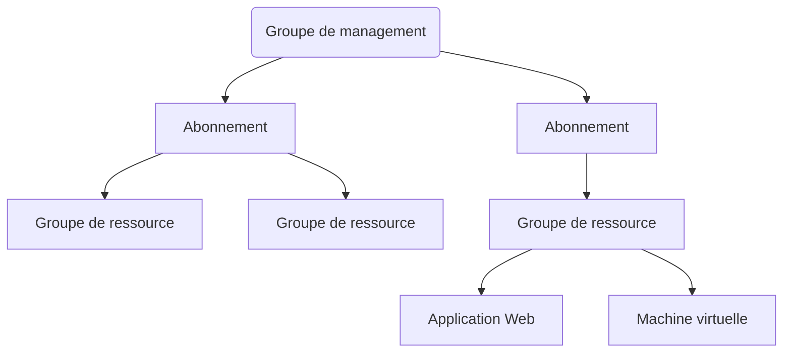

Si vous avez lu **“Microsoft”** et que vous n’avez pas fui, bienvenue sur cette
introduction à la solution de **Cloud Microsoft** !
Ayant travaillé deux ans sur la solution, j’ai eu envie de partager ce que j’avais pu apprendre sur **Azure** et livrer mes astuces et mon ressenti sur cet outil.

La star de cet article est **Microsoft Azure**. C’est la solution de **cloud computing** fournie par Microsoft.
Cet article a pour objectif de faire une brève **introduction de la solution**, son écosystème et permettre de faire ses **premiers** pas sur la solution.

Pour commencer, nous allons voir ce qu’est Azure, puis je donnerais un avis personnel sur la solution et nous finirons sur un premier tutoriel. 

Toujours présent ? Let’s go ! 

## Microsoft Azure, c’est quoi ? 

### Les concepts de Microsoft Azure

Comme dit plus haut, **Azure** est la **solution Microsoft de cloud**. Il permet l’accès à de nombreux **services hébergés par Microsoft**. Actuellement, on en répertorie une centaine, mais ce nombre augmente rapidement avec les innovations. 

Bien que cette solution soit principalement utilisée en tant que **cloud public**, Azure permet par l’utilisation d’**Azure Stack** de mettre en place un **cloud privé** et un **cloud hybride**. Cependant, nous n'aborderons que la notion de cloud public dans cet article.


> Petit rappel sur les notions de cloud privé, public et hybride :
>   - Le **cloud public** permet l’accès à différents services via les infrastructures Microsoft. 
>   - Le **cloud privé** permet l’accès à différents services aussi, mais hébergés sur sa propre infrastructure.
>   - Le **cloud hybride** est un mix des deux.


Faire une liste de l’ensemble des services Azure serait long et pas forcément intéressant.
Je vais donc lister ceux qui me semblent être les plus importants. Ils seront détaillés par la suite dans d’autres articles à venir.

Les **services Microsoft Azure principaux** sont : 
   - Computing (Machines virtuelles, conteneurs, kubernetes, etc.), 
   - Sécurité (Pare-feu, étude des menaces, monitoring, etc.),
   - Identité (Active directories, etc.),
   - Réseau (route, dns, gateway, etc.),
   - Stockage (bases de données, différents types de stockage en fonction des besoins, etc.),
   - IOT (API, Azure Cosmos DB, etc ...)

Cependant, si vous souhaitez la **liste exhaustive**, voici le lien vers la page du **site de Microsoft** qui détaille l’ensemble : [Liste des services Azure](https://azure.microsoft.com/fr-fr/services/)

Comme beaucoup de solutions cloud, ces services sont hébergés dans différents datacenters, localisés dans différents pays.

### L’écosystème Azure.

Azure est déjà une plate-forme applicative cloud complète, mais elle possède également un **écosystème intéressant**, et notamment : 

**Azure DevOps** qui est une **boite à outils pour DevOps** assez complète. Elle permet via une seule interface de : 
  - Gérer des items “agiles” (Epics, User stories, sprint, etc.),
  - Synchroniser un github et y avoir accès via l’interface,
  - Gérer les builds, les artéfacts,
  - Gérer les pipelines,
  - Gérer la création et l’application de tests automatisés.
  
Pour plus d’information, vous pouvez jeter un œil ici : [Documentation Azure Devops](https://azure.microsoft.com/fr-fr/services/devops/)

**Office365** qui est un service de **gestion de postes utilisateurs** (en terme 'plus barbare', moderne workplace). Il permet la gestion de ce dont un poste Windows doit avoir besoin. Par exemple les mails, les logiciels. 

**PowerApps** qui est un outil permettant de créer une application avec peu de code. Il est principalement utilisé pour **automatiser des processus métier**. 

## Mon ressenti par rapport à Azure

### Les forces d’Azure

La **force principale d’Azure** (et ce ne sera pas une surprise), est sa **compatibilité avec les services Microsoft**. En effet, il est **simple** de coupler son infrastructure cloud Azure avec celle que l’on a en local. 
Il en est de même avec Office365 vue plus haut et qui est un service qui occupe une place importante chez Microsoft.

Sa seconde force selon moi est son service Azure DevOps. Il permet la mise en place d’une première démarche DevOps assez facilement, avec une administration simplifiée et un côté graphique qui peut être rassurant. 

### Ses faiblesses

La force principale d’Azure est aussi sa plus grosse faiblesse : Le fait qu’il soit aussi bien intégré avec tout ce qui touche à Microsoft et favorise l’accès au service Microsoft, peut gêner pour la mise en place de solutions externes. De plus cela créer une dépendance à Microsoft.

Le second mauvais point reste dans le thème. Les **licences Microsoft** sont très/trop compliquées par rapport à ses concurrents directs comme AWS.

Maintenant que la partie théorique est terminée, passons aux choses sérieuses.

## Commençons à utiliser

### Accès à une version de test de la plateforme.

Microsoft fournit un accès pour tester sa solution. Il suffit d'effectuer les étapes suivantes.

1.  Cliquez sur le lien d'accès à la [version de test](https://azure.microsoft.com/fr-fr/free/)
2. Cliquez sur le bouton encadré en rouge.
	  
	  _**Image 1:** interface d'accès à l'abonnement gratuit_
4. Connectez-vous via le portail Microsoft. (si vous n’avez pas de compte, créez-en un)
5. Remplissez le formulaire avec vos informations. À la fin de la procédure, vos informations bancaires vous seront demandés. C’est une sécurité pour éviter de créer plusieurs comptes gratuits. 

### Votre première Infrastructure

Dans ce chapitre, nous verrons ensemble quelques notions importantes complétées par des exemples concrets. 

#### Les bases de l’organisation des ressources

La compréhension de l'arborescence des ressources sur Azure permet de mieux organiser ses ressources et vous simplifiera la vie pour l'administration et la gestion des coûts.
Nous avons donc : 
  - le groupe de management, qui peut gérer plusieurs Abonnements.
  - l'abonnement qui contient plusieurs groupes de ressources.
  - les groupes de ressources qui peuvent contenir plusieurs ressources Azure (machines virtuelles, applications, …). 

Voici un **schéma** qui résume l'ensemble : 


#### Votre première machine virtuelle

Pour ce premier tutoriel, nous allons  effectuer les étapes suivantes : 

   - Vérifier la présence d'un abonnement,
    - Créer votre premier groupe de ressource,
    - Créer votre premier Groupes de sécurité réseau,
    - Créer votre première machine virtuelle,
    - Tester la connexion,
    - Supprimer les ressources.

Reprenons notre compte fraîchement crée. 

##### Vérfier l'abonnement 

Nous allons commencer par vérifier que nous possédons bien un abonnement de disponible.

 1. Dans l'onglet de recherche, entrez 'abonnement' **(1)**
 2. Selectionnez 'Abonnement' **(2)**
 3. Vérifiez qu'il est bien présent **(3)**

   
  
##### La création du Groupe de ressource

Nous avons un abonnement fonctionnel , nous allons ajouter un 'Groupe de ressource' dans laquelle mettre notre machine Virtuelle

 1. Dans l'onglet de recherche, entrez 'Groupe de ressource'  **(1)**
 2. Selectionnez 'Groupe de Ressource' **(2)**
 3. Cliquez sur 'Créer'  **(3)**

   

4. Entrez le nom du groupe **(1)**
5. Cliquez sur 'Vérifier + Créer' **(2)**


#####  Groupes de sécurité réseau

Nous allons créer et ajouter un Groupes de sécurité réseau. C'est l'équivalant du 'pare-feu' version Azure.

 1. Dans l'interface de recherche, entrez 'Groupes de sécurité réseau' **(1)**
 2. Sélectionnez 'Groupes de sécurité réseau' **(2)**
 3. Cliquez sur 'Créer' **(3)**

   
   
 4. Entre le nom du groupes de sécurité réseau **(1)**
 5. Vérifier que la région est bien en 'France'. **(1)**
 6. Cliquez sur 'Vérifier + Créer' **(3)**

   

   7. Vous avez ici les règles par défaut affichées **(1)**
   8. Cliquez sur 'Règle de sécurité de trafic entrant **(2)**

   

   9. Cliquez sur 'Ajouter'**(1)**
   10. Entrez en source 'Any'**(2)**
   11. Entrez en plage de port source **(3)**
   12. Entrez en destination 'Any'**(4)**
   13. Entrez en Service 'SSH' **(5)**
   14. Cochez 'Autoriser' **(6)**
   15. Entrez le nombre pour la priorité **(7)** 
 
 

> Le choix du nombre pour indiquer la priorité est simple. Plus le nombre est petit, plus il sera traité avant les autres. Les règles de blocages ont des nombres plus grand que ceux qui autorisent.

> La règle ajoutée permet de se connecter à la machine virtuelle en étant hors du réseau Azure. 

#####  Création de la Machine Virtuelle

 1. Dans l'onglet de recherche, entrez 'machine virtuelle'**(1)**
 2. Selectionnez 'Machines Virtuelles' **(2)**
 3. Cliquez sur 'Créer' (3) **(3)**

   

 4. Ajouter notre Groupe de Ressources**(1)**
 5. Ajouter le nom de la Machine Virtuelle **(2)**
 6. Vérifier que la région est bien 'France' ou le pays le plus proche du vôtre **(3)**
 7. Choisir l'OS de la machine **(4)**
 8. Choisir la taille en fonction du besoin **(5)**
 9. Cliquez sur 'Suivant : Disques' 

   

11. Selectionner le type de disque qui vous intéresse **(2)**

   

12. Au niveau de 'Groupe de sécurité réseau de la carte réseau', cochez 'Paramètres avancés'**(1)**
13. Selectionner le groupe réseau crée précédemment.
14. Cliquez sur 'Vérifier + créer'
         


#####  Connexion à la machine virtuelle

Nous allons maintenant vérifier la connexion à la machine virtuelle.
1. Lors de la création, Azure vous créera une clé. Enregistrez celle ci et placer là dans votre répertoire de clé.
2.  Allez sur 'machine virtuelle' comme vu plus haut, vous verrez votre nouvelle machine. 
3. Selectionner votre machine, et copiez votre adresse IP.
4. Entrez la commande : _ssh -i [votre-clé].pem [votre-user]@[votre-IP]_

##### Suppresion des ressources

Pour terminer ce tutoriel, supprimez vos ressources 
1. Lancez 'Powershell'
2. Entrez _Az login_
3. Entrez vos information de connections. 
4. Utiliser le script pour supprimer vos ressources une par une. (par exemple ici une machine virtuelle)
```
az resource delete \ --resource-group ExampleResourceGroup \ --name ExampleVM \ --resource-type  "Microsoft.Compute/virtualMachines"
```
5. Supprimer maintenant votre Groupe de ressource.
```
az group delete --name ExampleResourceGroup
```

## Le mot de la fin 

Voici un **premier aperçu** de la solution Azure. Nous avons pu voir rapidement l’utilité de la solution, et en quoi elle et son écosystème peuvent être intéressants. Vous avez aussi fait vos premiers pas sur la solution.
Si vous cherchez plus d’information, je ne peux que vous rediriger vers la documentation Microsoft sur le sujet. 
Dans de prochains articles, nous irons plus loin dans la configuration de la solution et nous verrons les services plus en détail.


