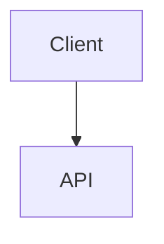

# Rédiger un contenu en MDX

Les articles (`_articles`) et les tutoriels (`_tutorials`, fichier `index` et étapes) peuvent être écrits en [MDX](https://mdxjs.com/) : il suffit de donner l'extension `.mdx` au fichier au lieu de `.md`. Le MDX est du markdown dans lequel on peut utiliser des composants React.

Les fichiers `.md` existants restent rendus comme avant, il n'est pas nécessaire de les convertir.

## En-tête

L'en-tête (frontmatter) est identique à celui d'un fichier `.md` et il est validé de la même manière.

## Le markdown d'abord

Un fichier `.mdx` s'écrit comme un fichier `.md` : tout ce que le markdown sait déjà rendre s'écrit en markdown, et le rendu est identique à celui d'un article `.md`. N'utilisez un composant que lorsque le markdown n'a pas d'équivalent.

### Citation

```md
> La simplicité est la sophistication suprême.
```

### Bloc de code coloré

````md
```ts
const answer: number = 42;
```
````

### Diagramme Mermaid

Un diagramme [Mermaid](https://mermaid.js.org/) s'écrit dans un bloc de code `mermaid` :

````md

````

## Composants disponibles

Seuls les composants suivants sont utilisables, sans import. Tout autre composant, y compris `Blockquote`, `SyntaxHighlighter` ou `Mermaid`, fait échouer la validation : utilisez la syntaxe markdown ci-dessus.

### `Reminder`

Un encadré de rappel. `variant` accepte `note`, `summary`, `info`, `tip`, `success`, `question`, `warning`, `failure`, `danger`, `bug`, `example` ou `quote`.

```mdx
<Reminder variant="tip" title="Astuce">

Le contenu est du **markdown** : laissez une ligne vide après la balise ouvrante et avant la balise fermante.

</Reminder>
```

C'est l'équivalent MDX des admonitions HTML des fichiers `.md` (`<div class="admonition tip" markdown="1">`).

### `Figure`

Une image et sa légende. En MDX, c'est la syntaxe à privilégier plutôt que la ligne `Figure:` du markdown : l'image et sa légende sont regroupées, plus simples à écrire et à relire.

La légende s'écrit entre les balises, en markdown :

```mdx
<Figure src="{BASE_URL}/imgs/articles/2026-09-24-mon-article/schema.png" alt="Schéma de l'architecture">*Source : [Eleven Labs](https://eleven-labs.com/)*</Figure>
```

Une légende sans mise en forme peut aussi passer par `caption` :

```mdx
<Figure src="{BASE_URL}/imgs/articles/2026-09-24-mon-article/schema.png" alt="Schéma de l'architecture" caption="Source : Eleven Labs" />
```

Comme pour une image markdown, `alt` décrit l'image, et les paramètres `maxWidth`, `maxHeight`, `width` et `height` de l'URL la dimensionnent (`schema.png?maxWidth=400`).

## Différences avec le markdown

- `<` et `{` ouvrent une balise ou une expression en MDX : dans le texte, échappez-les (`\<`, `\{`) ou placez-les dans du code.
- Le HTML est interprété comme du JSX : utilisez `className` au lieu de `class` et fermez les balises vides (`<br />`).
- Les admonitions en HTML (`<div class="admonition tip" markdown="1">`) ne sont pas prises en charge : utilisez le composant `Reminder`.
- Les commentaires s'écrivent `{/* commentaire */}` au lieu de `<!-- commentaire -->`.

## Validation

`pnpm validate-markdown`, lancé par la CI, compile chaque fichier `.mdx` en plus des vérifications déjà faites sur le markdown. Une syntaxe invalide ou un composant non autorisé est signalé avec la ligne et la colonne concernées.

## Ajouter un composant

Les composants autorisés sont déclarés dans `src/helpers/mdxComponents.tsx`. N'y ajoutez un composant que si le markdown n'a pas d'équivalent. Le contenu est rendu en HTML statique : un composant ne doit pas dépendre d'un état ou d'événements côté client.
