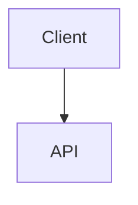

# Rédiger un contenu en MDX

Les articles (`_articles`), les tutoriels (`_tutorials`, fichier `index` et étapes) et les fiches auteur (`_authors`) s'écrivent en [MDX](https://mdxjs.com/), avec l'extension `.mdx`. Le MDX est du markdown dans lequel on peut utiliser des composants React. Un fichier `.md` est refusé par la validation.

## En-tête

L'en-tête (frontmatter) s'écrit en YAML, entre deux lignes `---`, au début du fichier.

## Le markdown d'abord

Tout ce que le markdown sait rendre s'écrit en markdown. N'utilisez un composant que lorsque le markdown n'a pas d'équivalent, et n'écrivez pas de HTML : la validation le signale par un avertissement.

### Citation

```md
> La simplicité est la sophistication suprême.
```

### Bloc de code coloré

````md
```ts
const answer: number = 42;
```
````

### Diagramme Mermaid

Un diagramme [Mermaid](https://mermaid.js.org/) s'écrit dans un bloc de code `mermaid` :

````md

````

## Composants disponibles

Seuls les composants suivants sont utilisables, sans import. Tout autre composant, y compris `Blockquote`, `SyntaxHighlighter` ou `Mermaid`, fait échouer la validation : utilisez la syntaxe markdown ci-dessus.

### `Reminder`

Un encadré de rappel. `variant` accepte `note`, `summary`, `info`, `tip`, `success`, `question`, `warning`, `failure`, `danger`, `bug`, `example` ou `quote`.

```mdx
<Reminder variant="tip" title="Astuce">

Le contenu est du **markdown** : laissez une ligne vide après la balise ouvrante et avant la balise fermante.

</Reminder>
```

### `Figure`

Une image et sa légende, regroupées pour être plus simples à écrire et à relire.

La légende s'écrit entre les balises, en markdown :

```mdx
<Figure src="{BASE_URL}/imgs/articles/2026-09-24-mon-article/schema.png" alt="Schéma de l'architecture">*Source : [Eleven Labs](https://eleven-labs.com/)*</Figure>
```

Une légende sans mise en forme peut aussi passer par `caption` :

```mdx
<Figure src="{BASE_URL}/imgs/articles/2026-09-24-mon-article/schema.png" alt="Schéma de l'architecture" caption="Source : Eleven Labs" />
```

Comme pour une image markdown, `alt` décrit l'image, et les paramètres `maxWidth`, `maxHeight`, `width` et `height` de l'URL la dimensionnent (`schema.png?maxWidth=400`).

## Particularités du MDX

- `<` et `{` ouvrent une balise ou une expression : dans le texte, échappez-les (`\<`, `\{`) ou placez-les dans du code.
- Le HTML est à éviter. Lorsqu'il reste indispensable, pour intégrer un tweet ou une vidéo par exemple, il s'écrit comme en HTML (`class`, `style="…"`) et il est rendu comme le markdown, mais toute balise doit être fermée : `<br />`, ``, `<p>…</p>`.
- Un retour à la ligne se fait par une ligne vide, qui commence un nouveau paragraphe, et non par `<br />`.
- Une balise de bloc (`<div>`, `<blockquote>`, `<table>`…) qui s'étend sur plusieurs lignes doit être seule sur sa ligne d'ouverture et sur sa ligne de fermeture.
- Les commentaires s'écrivent `{/* commentaire */}` au lieu de `<!-- commentaire -->`.
- Il n'y a ni lien automatique entre chevrons (`<https://…>`) ni code indenté : écrivez `[https://…](https://…)` et utilisez un bloc de code entre ` ``` `.

## Validation

`pnpm validate-markdown`, lancé par la CI, valide l'en-tête, les titres et les images, puis compile chaque fichier `.mdx`. Une syntaxe invalide ou un composant non autorisé fait échouer la validation, avec la ligne et la colonne concernées.

Sans faire échouer la validation, un avertissement signale chaque image sans texte alternatif et chaque élément HTML, avec sa ligne. Dans une pull request, il apparaît en annotation sur le fichier.

## Ajouter un composant

Les composants autorisés sont déclarés dans `src/helpers/mdxComponents.tsx`. N'y ajoutez un composant que si le markdown n'a pas d'équivalent. Le contenu est rendu en HTML statique : un composant ne doit pas dépendre d'un état ou d'événements côté client.
