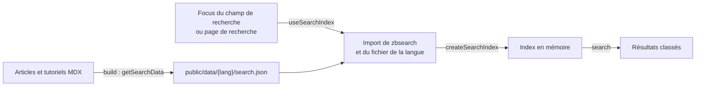

# Moteur de recherche

La recherche du blog (autocomplete de l'en-tête et page `/:lang/search/`) s'exécute dans le navigateur avec [zbsearch](https://github.com/micheleriva/zbsearch), un moteur de recherche full-text écrit en JavaScript (une reprise d'Orama par son équipe d'origine). Elle ne dépend d'aucun service externe : elle remplace Algolia, qui demandait des clés d'API et une indexation séparée du build.

Ce document décrit son fonctionnement, puis les problèmes de pertinence rencontrés lors de sa mise en place et la façon dont ils ont été corrigés. Lisez-le avant de modifier le classement des résultats : chaque réglage répond à un cas précis, et le changer peut en faire réapparaître un autre.

## Vue d'ensemble



| Étape | Fichier | Rôle |
| --- | --- | --- |
| Build | `src/helpers/contentHelper.ts` (`getSearchData`) | Écrit un fichier `public/data/{lang}/search.json` par langue, en même temps que les autres données JSON (`pnpm build`, et au démarrage de `pnpm start:dev`). |
| Chargement | `src/hooks/useSearchIndex.ts` | Télécharge le code de recherche et le fichier de la langue au premier focus du champ de recherche, ou à l'ouverture de la page de recherche. Une seule fois par langue et par visite. |
| Indexation et recherche | `src/helpers/searchHelper.ts` (`createSearchIndex`) | Construit l'index zbsearch en mémoire et classe les résultats. |
| Affichage | `src/containers/LayoutTemplateContainer/useHeaderContainer.tsx`, `src/containers/SearchPageContainer/useSearchPageContentContainer.tsx` | Autocomplete (6 résultats) et page de recherche (tous les résultats). La mise en évidence des termes reste assurée par `TextHighlight`. |

### Ce qui est publié, et pourquoi pas un index tout fait

Le fichier `search.json` contient les articles eux-mêmes, pas un index sérialisé : l'index est construit dans le navigateur, en une vingtaine de millisecondes pour 355 articles. Un index sérialisé par zbsearch (`save`) pesait quatre fois plus lourd (212 Ko gzip contre 49 Ko, mesuré sur les articles français avant l'ajout des intertitres).

Chaque article y figure avec : `slug`, `lang`, `contentType`, `title`, `excerpt`, `date`, `readingTime`, `cover`, `categories`, `authorUsernames`, `authorNames`, `keywords` (champ du front matter) et `headings` (intertitres de niveau 2 d'un article, titres des étapes d'un tutoriel).

Poids en septembre 2026 :

| Fichier | Articles | Poids | gzip |
| --- | --- | --- | --- |
| `data/fr/search.json` | 355 | 250 Ko | 71 Ko |
| `data/en/search.json` | 67 | 40 Ko | 12 Ko |
| Code de recherche (zbsearch, mots vides, classement) | | 85 Ko | 29 Ko |

Rien de tout cela n'est téléchargé tant que la recherche n'est pas utilisée. Les intertitres représentent environ 40 % du fichier : ne garder que ceux de niveau 2 a économisé 11 Ko gzip par rapport aux niveaux 2 et 3.

## Comment une recherche est traitée

### 1. Découpage et normalisation des mots

Le texte des articles et la recherche passent par le même tokenizer zbsearch (`french` ou `english` selon la langue) :

- les mots sont mis en minuscules et leurs accents retirés (« sécurité » et « securite » se valent) ;
- les **mots vides** sont ignorés (`@zbsearch/stopwords`) : « les tests en php » cherche `test` et `php` ;
- la **marque du pluriel** est retirée (`removePlural`) : « tests » cherche `test`, « architectures » `architecture`. Un mot d'au moins quatre lettres terminé par un `s` ou un `x`, mais pas par `ss`, perd sa dernière lettre.

### 2. Sélection : tous les mots doivent être trouvés

Un article n'est retenu que s'il contient **tous** les mots de la recherche, quels que soient les champs où ils se trouvent. Le dernier mot, comme tous les autres, peut n'être que le début d'un mot de l'article : « symf » trouve « Symfony » pendant la saisie.

Si rien n'est trouvé, la recherche est relancée en tolérant **une faute de frappe** par mot (« symfny », « kubernets »).

### 3. Filtre des mots ambigus

Quelques noms de technologies sont aussi des mots courants (`AMBIGUOUS_WORDS` : `express`, `go`, `next`, `rest`, `rust`, `spark`, `swift`, `vite`, `vue`). Pour eux, un article n'est retenu que s'il les cite comme un nom (voir ci-dessous) : « vite » ne trouve pas « le temps passe vite ».

### 4. Classement

Chaque article reçoit un score [BM25](https://fr.wikipedia.org/wiki/Okapi_BM25) calculé par zbsearch, pondéré par le champ où le mot est trouvé :

| Champ | Poids |
| --- | --- |
| `title` | 4 |
| `keywords` | 3 |
| auteurs (identifiant et nom) | 3 |
| `categories` | 2 |
| `headings` | 1,5 |
| `excerpt` | 1 |

Ce score est ensuite :

- **divisé selon l'âge de l'article** : par 2 à 10 ans, par 1,5 à 5 ans. À pertinence proche, l'article récent passe devant ;
- **doublé si chaque mot de la recherche est un nom dans l'article**.

Enfin, pour une recherche contenant un **mot d'une ou deux lettres** (« ia », « go », « ci »), les articles qui contiennent ce mot en entier passent devant ceux qui n'en contiennent que le début.

Une recherche vide (page de recherche sans terme) renvoie tous les articles, du plus récent au plus ancien.

### Qu'est-ce qu'un « nom » ?

Un mot est considéré comme le nom d'une technologie, d'un concept ou d'une personne s'il figure :

- dans les `keywords`, les `categories` ou les auteurs de l'article, choisis par son auteur ;
- ou dans le titre, le résumé ou un intertitre avec une majuscule ailleurs qu'en première lettre (« GraphQL », « IA », « iOS ») ;
- ou avec une majuscule en première lettre, hors d'un début de texte ou de phrase (« Symfony et Vue.js »). La majuscule qui suit le début d'un texte, un `.`, `!`, `?`, `:`, `;`, `|` ou un tiret ne compte pas : « Vues et logique » n'est pas un nom.

## Problèmes rencontrés et corrections

Les problèmes ci-dessous ont été relevés en comparant les résultats d'une soixantaine de recherches réalistes en français et d'une vingtaine en anglais, sur les vrais articles.

### Un index sérialisé trop lourd

- **Constat** : l'index sauvegardé par `save()` de zbsearch pesait 212 Ko gzip pour les articles français.
- **Correction** : publier les articles et construire l'index dans le navigateur (49 Ko gzip à l'époque, 20 ms d'indexation).

### zbsearch se contente d'un mot sur plusieurs

- **Constat** : par défaut (`threshold: 1`), zbsearch renvoie les articles qui contiennent au moins un des mots : « zzzz php » renvoyait les 94 articles PHP. Avec `threshold: 0`, il exige tous les mots, mais dans un même champ : « symfony fpasquet » ne trouvait pas un article dont le titre contient l'un et les auteurs l'autre.
- **Correction** : tous les champs sont aussi réunis dans une propriété `searchableText`, qui sert à sélectionner les articles avec `threshold: 0`. Le score est calculé par une seconde recherche sur les champs séparés, avec leurs poids.

### Des résultats triés par date, et du bruit en tête

- **Constat** : la première version reprenait le réglage d'Algolia, un tri par date décroissante, alors que la page affiche « triés par pertinence ». Combinée à la recherche par début de mot sur tous les champs, elle faisait remonter n'importe quel article récent : « ia » renvoyait 245 articles, « ci » 143, « vue » 80, les premiers hors sujet.
- **Correction** : un classement par pertinence (BM25 pondéré par champ), tempéré par l'âge de l'article. Une demi-vie de 10 ans a été retenue après comparaison avec 5 ans, qui laissait passer devant des articles récents qui ne font que citer le terme (« rabbitmq » plaçait en tête un article sur un CRM).

### Des articles introuvables

- **Constat** : le champ `keywords` du front matter, renseigné sur 412 contenus, n'était lu par aucun code. « sécurité » ne trouvait qu'un article, « webpack » aucun.
- **Correction** : les `keywords` et les intertitres sont indexés. « sécurité » trouve 19 articles, « webpack » 3.

### Les mots vides bloquaient les recherches en langage naturel

- **Constat** : tous les mots devant être trouvés, « mise en place d'une api » exigeait aussi « en » et « une ».
- **Correction** : les mots vides de `@zbsearch/stopwords` sont ignorés.

### La tolérance aux fautes de frappe ajoutait du bruit

- **Constat** : une faute tolérée en permanence faisait trouver « vie » et « rue » à « vue », et « REST » ou « just » à « rust ».
- **Correction** : la faute n'est tolérée que si la recherche exacte ne trouve rien.

### La racinisation abîmait les mots en cours de saisie

- **Constat** : les racinisateurs de `@zbsearch/stemmers` (algorithme Snowball) réduisent les mots à leur racine, y compris un mot incomplet : « rea » devenait « re », et l'autocomplete renvoyait 225 articles au lieu de ceux sur React.
- **Correction** : seule la marque du pluriel est retirée (`removePlural`). Une règle qui ne fait que retirer une lettre finale ne peut pas raccourcir un début de mot au point de changer ce qu'il trouve. En contrepartie, « performant » n'est plus rapproché de « performance », ni « déployer » de « déploiement ».

### Les mots très courts trouvaient trop de choses

- **Constat** : un mot d'une ou deux lettres est aussi le début de nombreux mots : « ia » plaçait « IAM aws » en deuxième position, « go » trouvait « google » et « goal ».
- **Correction** : pour un tel mot, les articles qui le contiennent en entier passent devant ceux qui n'en ont que le début. Au-delà de deux lettres, le début de mot reste recherché tel quel, pour que l'autocomplete trouve React pendant qu'on tape « rea ».

### Les homonymes

- **Constat** : « go » trouvait aussi « Should you go hybrid? ».
- **Correction** : le score est doublé quand chaque mot de la recherche est un nom dans l'article. Une technologie s'écrit presque toujours avec une majuscule ou figure dans les `keywords`, l'homonyme est en minuscules.
- **Effet de bord corrigé** : une majuscule en début de phrase faisait passer le nom commun pour une technologie : « vue » trouvait les articles dont un intertitre commence par « Vues ». La majuscule d'un début de texte ou de phrase n'est plus prise en compte.

### Les noms de technologies qui sont aussi des mots courants

- **Constat** : aucun article ne parle de l'outil Vite, mais « vite » renvoyait trois articles contenant l'adverbe (« le temps passe vite »). Rien dans le texte ne distingue les deux : l'adverbe est en minuscules, et il n'existe pas d'article sur l'outil pour servir de comparaison.
- **Correction** : la liste `AMBIGUOUS_WORDS` de `src/helpers/searchHelper.ts`. Pour ces mots, seuls les articles qui les citent comme un nom sont retenus. Un nom qui commence par le mot suffit : « vue » trouve un article dont les `keywords` contiennent « vuejs ». « vite » ne renvoie plus rien, « rust » non plus (il trouvait « REST » par faute de frappe), et « go » ne trouve plus le verbe anglais.
- **Ajouter un mot** : quand une recherche sur une technologie renvoie des articles où son nom est employé comme un mot courant. N'y ajoutez pas un mot qui a un sens technique en minuscules (« test », « cache ») : les articles qui l'emploient ainsi disparaîtraient des résultats.

### Les paquets zbsearch introuvables par TypeScript

- **Constat** : `@zbsearch/stopwords` n'expose ses langues que par le champ `exports` de son `package.json`, que `"moduleResolution": "Node"` ignore.
- **Correction** : `tsconfig.json` utilise `"moduleResolution": "Bundler"`, le réglage prévu pour un projet construit par Vite.

## Limites connues

- Un mot est cherché tel qu'il est écrit, au pluriel près : « déployer » ne trouve pas « déploiement ».
- Un homonyme qui n'est pas dans `AMBIGUOUS_WORDS` reste dans les résultats, après les articles qui citent le nom.
- Le contenu des articles n'est pas indexé, seulement leur titre, résumé, intertitres, mots-clés, catégories et auteurs. L'indexer multiplierait le poids du fichier.
- `search.json` grossit avec le nombre d'articles, d'environ 200 octets gzip par article.

## Modifier le classement

Les réglages sont les constantes en tête de `src/helpers/searchHelper.ts` : `BOOST`, `RECENCY_HALF_LIFE_IN_YEARS`, `NAME_MATCH_BOOST`, `SHORT_WORD_MAX_LENGTH`, `AMBIGUOUS_WORDS`.

1. Les tests de `src/helpers/searchHelper.test.ts` décrivent les cas corrigés ci-dessus ; ceux des homonymes, des mots courts et des mots ambigus échouent si le réglage correspondant est retiré. Gardez-les verts, et ajoutez un test pour tout nouveau cas.
2. Comparez les résultats sur les vrais articles avant et après la modification. Après un `pnpm build`, ce script affiche les cinq premiers résultats de quelques recherches :

   ```ts
   // search-eval.ts, à lancer avec : pnpm ts-node search-eval.ts fr "symfony,ia,tests unitaires"
   import { readFileSync } from 'node:fs';

   import { createSearchIndex } from '@/helpers/searchHelper';

   const [lang, terms] = process.argv.slice(2);
   const searchIndex = createSearchIndex({
     lang,
     posts: JSON.parse(readFileSync(`public/data/${lang}/search.json`, 'utf8')),
   });

   for (const term of terms.split(',')) {
     const posts = await searchIndex.search(term);
     console.log(`\n${term} (${posts.length})`);
     posts.slice(0, 5).forEach((post) => console.log(`  ${post.date.slice(0, 4)} ${post.title}`));
   }
   ```

   Vérifiez au moins les recherches citées dans ce document : une amélioration sur un cas en dégrade souvent un autre.
